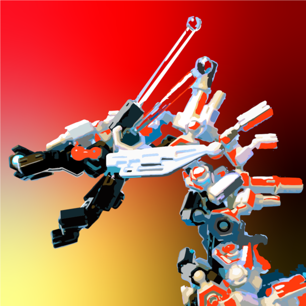

# 創作物紹介

## 概要

omemoji のポートフォリオ

### リンク

https://omemoji.com

## 使用している技術

- Astro
- Tailwind CSS
- TypeScript
- Cloudflare Pages

## Todo

### 全般

- [x] デザインをモダンで統一感あるものにする
- [x] サイトマップ
- [x] ページネーション
  - [x] タグページのページネーション
- [x] OGP 画像をビルド時に生成
- [ ] RSS

### About

- [x] 自分のプロフィールやアカウント、実績などを載せる

### Artworks

- [x] 個別の作品ページを動的ルーティング
- [x] 作品一覧
- [x] Tag 機能
- [x] 管理画面から作品とその情報をアップロード出来るようにする
- [x] 横スクロールの作品選択欄（Pixiv みたいな）

### Articles

- [x] Markdown で記事を書けるようにする
- [x] 個別の記事を動的ルーティング
- [x] Tag 機能
- [x] リンクカード
  - [x] 画像を最適化
- [x] 目次

## 備考

- [x] Astro で書き直した
- [x] HonoX で書き直す可能性あり 
