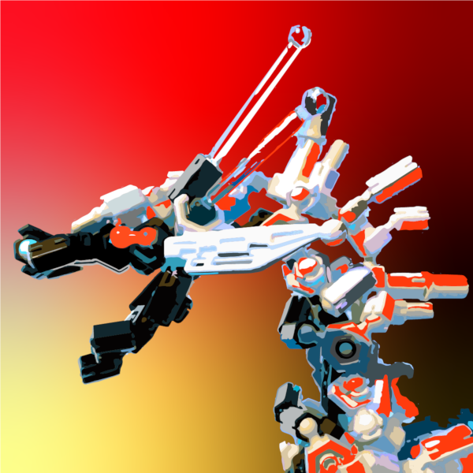

# 創作物紹介

## 概要

omemoji のポートフォリオ

### リンク

https://omemoji.com

## 機能

### 全般

- [ ] デザインをモダンで統一感あるものにする
- [ ] サイトマップ
- [ ] ページネーション
  - [ ] タグページのページネーション
- [ ] RSS

### About

- [ ] 自分のプロフィールやアカウント、実績などを載せる

### Artworks

- [ ] 個別の作品ページを動的ルーティング
- [ ] 作品一覧
- [ ] Tag 機能
- [ ] 管理画面から作品とその情報をアップロード出来るようにする
- [ ] OGP 画像をビルド時に生成
- [ ] 横スクロールの作品選択欄（Pixiv みたいな）

### Articles

- [ ] Markdown で記事を書けるようにする
- [ ] 個別の記事を動的ルーティング
- [ ] Tag 機能
- [ ] リンクカード
  - [ ] 画像を最適化
- [ ] 目次
