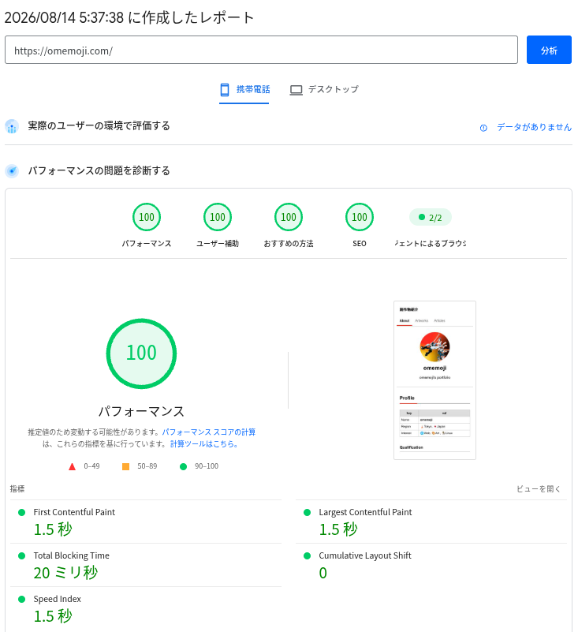

## はじめに

https://github.com/omemoji/omemoji.com

個人サイト「[創作物紹介](https://omemoji.com)」を、TypeScript + Bun で実装し直した。\
本記事では自作SSG[^ssg]の設計や各種機能、および作ってみた感想について記す。

[^ssg]: SSG とは Static Site Generator の略で、Webサイトのページを（リクエストごとにサーバで生成して返すのではなく）静的HTMLとしてビルド時に全て生成しておく方式のことを指す。「創作物紹介」もSSGで作成されている

### 背景：SSGをフルスクラッチした理由

静的なコンテンツを扱うWebサイトを作りたいだけなら、既に [Astro](https://astro.build/)、[Eleventy](https://www.11ty.dev/) や [Hugo](https://gohugo.io/) など数多くの優れたSSGフレームワークが存在する。実際、「創作物紹介」もこれまでは Astro を用いて制作していた。では、何故わざわざ自作したのか？その理由は主に以下の2つである。

#### 1. 真に自由な、自立したプラットフォームを手に入れるため

個人サイト ── それがNext.js製であれAstro製であれWordPress製であれ ── はそれ自体、企業が提供するSNSやブログサービスに比べれば間違いなく遥かに自由ではある。
投稿するコンテンツの内容、レイアウト、その他あらゆる機能追加を自分の思い通りに決定することが出来るからだ[^platform]。

しかし、そのWebサイトを支えるフレームワークについては？
（SNSと同じように）自分以外の誰かが用意したフレームワークを使っている限り、あらゆる大規模な破壊的変更、最悪の場合メンテナンスの終了が自分の意図しないタイミングで発生しうる。例えば Next.js はv13にてApp Routerが実装された結果、規定のディレクトリ構成から変わったのみならず以降の新機能がApp Router前提で展開されるようになった事例がある。この場合、フレームワークの移行は単なるライブラリの更新作業を遥かに超える重労働（下手するとアーキテクチャからの変更が必要）となるだろう[^to_app_router]。

[^to_app_router]: https://nextjs.org/docs/app/guides/migrating/app-router-migration

このリスクを低減する賢い方法の一つは、最初からAstroのような比較的移行しやすいフレームワークを選定することである。
しかし、筆者はより極端な方法をとった ── **フレームワークを使わずSSGを自作してしまえば、そもそも移行する必要がない**。
最終的にHTMLを生成するまでのロジックを全て自前で書くことで、フレームワークどころか言語にすら縛られない本物の自由を手に入れることが出来る。
実際には[後述](#言語選定について)の理由からTypeScriptを使用しているが、その気になればRustやGoに移植することさえ不可能ではない。

[^platform]: ホスティングサービスの規約、および各国の法の制約は受ける

#### 2. 既存実装が持つ問題を修正するため

これまで「創作物紹介」の作成に使用してきたフレームワークは Next.js と Astroの2つであるが、それぞれ少しずつ不満点があった。

##### Next.js

- やりたいことに対して機能が過剰であり、node_modulesも肥大化する
  - そもそもSSGがメインターゲットではない
- SSGであっても遷移用のJavaScriptをクライアントにロードしてしまう
  - 初回クリック時にページ表示のパフォーマンスが下がる
- バージョンアップに伴う破壊的変更が多い

##### Astro

- `.md`ではなく`.mdx`を使わないとMarkdownの要素をカスタムコンポーネントに置き換えられない
- テンプレートやコンポーネントにJSXではなく`.astro`という独自ファイル形式を使う
- content collections の同期やVite起動のオーバーヘッドにより、初回起動の立ち上がりが遅い

上記の問題はどれもフレームワークの仕様によるものなので、SSGを自作してしまえば全て解決出来る。つまり、既存のあらゆるSSGのいいとこ取りが出来るのだ。

## システム設計

### 技術選定

| 項目                  | 選定結果         |
| --------------------- | ---------------- |
| 言語                  | TypeScript       |
| ランタイム            | Bun              |
| UIライブラリ          | React   (TSX)    |
| CSSフレームワーク     | なし             |
| Linter / フォーマッタ | Biome            |
| CI / CD               | GitHub Actions   |
| デプロイ環境          | Cloudflare Pages |

フレームワーク・ライブラリ依存を徹底的に避けた結果、上記のような技術選定となった。
強いて言うなら Bun に実行環境とテスト環境を依存している点でやや不自由ではあるが、可能な限りNode互換のAPIを使用するようにしている[^bun]。

[^bun]: Bun API に依存しているのは build / dev スクリプト、およびテストのみ。また、テストに関してはJestやVitest等と記法がある程度共通しているため移行は容易である

#### 言語選定について

SSGは本質的には「MarkdownやjsonからHTMLを生成する」システムである以上、必ずしもTypeScriptを使う必要はない。
しかし「創作物紹介」の要件や設計を踏まえると、以下の理由からやはりTypeScriptに優位性があると判断した。

- Markdown変換ライブラリが充実している
  - 最も重要。Markdown変換自体は他の言語でも可能だが、プラグイン（ルビ、数式、自作リンクカードプラグインなど）の充実度で remark / JS エコシステムに並ぶ言語は存在しない
- 言語の純粋なパフォーマンスがあまり重要ではない
  - 画像キャッシュが有効ならビルド時間は1~2秒で済む（Bunの場合）
  - キャッシュが無効な場合でも画像最適化にSharp（内部で**C言語**の画像処理ライブラリlibvipsを使用）が使われているため、言語の変更によるパフォーマンス最適化の余地があまりない
- Astro（現在の実装）から移行しやすい
- 筆者がTypeScript以外の言語をあまり使ったことがない

### ディレクトリ構成（抜粋）

データの流れる順に並べると以下の通り。
Astro を参考に、役割ごとにディレクトリを分割した。

```
.
├── content/                 # コンテンツ（実データ）
│   ├── articles/<年>/<月>/<slug>/   # 本文 .md と画像を同じディレクトリに置く
│   ├── artworks/<id>/               # meta.json と作品画像
│   └── about/
├── public/                  # 加工せず out/ へ複製する静的ファイル
├── src/
│   ├── collections/         # コンテンツの読み込みと zod による検証
│   ├── features/            # コンテンツの読み込み以外の各種機能
│   │   ├── markdown/        #   Markdown → hast → React 要素 に変換
│   │   ├── image/           #   画像最適化（AVIF 変換と寸法マニフェスト取得）
│   │   ├── og/              #   OGP 画像の生成
│   │   ├── link-card/       #   リンク先メタデータの取得
│   │   ├── asset/           #   CSS / JS のマニフェスト
│   │   └── sitemap/
│   ├── routes.ts            # コンテンツ → ルートテーブル（I/O を持たない純粋関数）
│   ├── pages/               # ルート 1 種につき 1 つ。props から要素を返す
│   ├── layouts/             # 全ページ共通の <head> と外枠
│   ├── components/          # UI 部品
│   ├── styles/
│   └── config.ts
├── scripts/
│   ├── build.ts             # ビルドを行う。I/Oの起点
│   ├── dev.ts               # リクエストごとに 1 ページだけ描く開発サーバ
│   └── gen-schema.ts        # zod スキーマ → content/artworks/_schema.json
├── .cache/                  # ビルドを跨いで残す変換結果（gitignore）
└── out/                     # 出力（gitignore）
```

## 実装したもの

基本的には既存機能となる。
ただし、フレームワーク依存の部分を自前で補う・各種改善を加えるなど、修正箇所は決して少なくない。

### ページのルーティング

恐らく最も独自性の高い部分。 
Astro では`src/pages`配下の`.astro`ファイルの構成および`getStaticPaths()`関数によってルーティングを自動で生成してくれた[^routing_astro]が、この自作SSGでは`routes.ts`に純粋関数としてルーティングを記述する。
考え方としては、TanStack Routerのcode-based routing[^vs_tanstack]と似ている。

https://tanstack.com/router/latest/docs/routing/code-based-routing

[^routing_astro]: https://docs.astro.build/ja/guides/routing/
[^vs_tanstack]: ただし、こちらはコンテンツデータも`routes.ts`内で渡す（`scripts/build.ts`で注入）。

```ts title=routes.ts
export type PageProps = {
  /** about.md の本文。記事と違い 1 件しかないためスキーマを持たない */
  AboutPage: { body: string };
  NotFoundPage: undefined;
  ArticlesList: ListProps<Article>;
  ArtworksList: ListProps<Artwork>;
  ArticlePage: { article: Article };
  /** 一覧の帯（GalleryRow）が全作品を必要とするため、詳細でも全件を渡す */
  ArtworkPage: { artwork: Artwork; artworks: Artwork[] };
};

//...

export type Route = {
  [P in keyof PageProps]: {
    path: string;
    /** サイトマップに載せるか。タグ別とページネーション 2 ページ目以降は false */
    indexable: boolean;
    page: P;
  } & (PageProps[P] extends undefined ? { props?: undefined } : { props: PageProps[P] });
}[keyof PageProps];

//...

export function buildRoutes({ articles, artworks, about }: Content): Route[] {
  //...
  return [
    { path: "/", indexable: true, page: "AboutPage", props: { body: about } },
    // 作品（作品データ配列を元に生成）
    ...artworksListRoutes,
    ...artworkRoutes, 
    // 記事（記事データ配列を元に生成）
    ...articlesListRoutes,
    ...articleRoutes,
    // 404。Cloudflare Pages が out/404.html を拾う。サイトマップには載せない
    { path: "/404", indexable: false, page: "NotFoundPage" },
  ];
}
```

これにより、以下のメリットが生まれる：

- ルーティングを純粋関数として表現出来る
  - I / O を`scripts/build.ts`に追い出した結果、ルーティングの単体テストが書けるようになった
- ページ集合を1つの型として表現出来る（`Route[]`）
  - ルートを横断するコードを型安全に書ける（キャストを使う必要がない）
- タグやページネーションを表現する際、ほぼ同じページ内容の`.tsx`ファイルを複数ディレクトリに置く必要がなくなる
  - 「創作物紹介」では作品・記事の一覧ページが該当
- サイトマップを`src/routes.ts`から直接生成するため、実際のルーティングとサイトマップにズレがなくなる
  - Astroだとルーティング以外に`filter`関数による除外ルールも管理する必要があり、二重管理に陥りやすい

### 作品公開機能

「創作物紹介」には、筆者が趣味で描いた絵を公開する機能がある。当然引き続き実装しているが、複数の点で改善を行っている。

まず、メタデータの管理方法を変更した。
`src/data/db.json`（全作品のメタデータを列挙した配列）に手動でメタデータを追加する方式をやめ、 `content/artworks/<artwork>`ディレクトリに作品画像と`meta.json`の2つを配置する形にした（作品の表示順は公開日時`date`の降順で指定する）。これにより、どの作品がどのメタデータを持つかが一目で分かるようになった。また、この方式は[Sveltia CMS](https://sveltiacms.app/en/)でのコンテンツ管理に対応しているため、今後の機能追加として想定している「作品投稿用CMSの追加」を実装しやすくなるメリットもある。


また、作品のメタデータを表すスキーマを作成し、そこからバリデーションおよび`Artwork`型の生成が出来るようにした。

```ts title=artworks.ts
// ...
export const artworkSchema = z.object({
  $schema: z.string().optional(),
  title: z.string(),
  description: z.string().optional(),
  // 変換は付けない。z.toJSONSchema が変換を含むスキーマを表現できないため
  date: z.iso.date(),
  src: z.string(),
  tags: z.array(z.enum(TAGS)),
  href: z.string().optional(),
});

/** date はスキーマでは文字列だが、ドメイン型では記事と揃えて Date で持つ */
export type Artwork = { id: string; date: Date } & Omit<z.infer<typeof artworkSchema>, "date">;
//...
```

これまでも記事に関しては（Astro組み込みの機能で）メタデータをzodスキーマでバリデーション+コンテンツの型をスキーマから生成するようにしていたが、作品に関しても同様のアプローチで型安全に管理出来るようになった。


### 記事の公開、およびMarkdownによる執筆機能

記事をMarkdownで執筆した上でHTMLに変換し、公開する機能もこれまで通り存在する。
Astroと異なり`import.meta.glob()`のような便利な組み込み関数はないので、記事本体とメタデータの一覧を取得する関数は自前で実装した。
また、作品と同じくzodを用いてバリデーション・型生成を行っている。

改善点として、カスタムコンポーネント（Markdown上の特定の記述をJSXコンポーネントに置き換える）機能をMarkdownで使えるようにした。Astroでは仕様によりMDXファイルでないとカスタムコンポーネントを使えなかったため、フレームワークに依存しない自作SSGの自由度の高さによって問題が解決された形となる。

### 画像最適化

作品・記事の画像やサムネイルを数多く扱う「創作物紹介」では、ページの読み込み時間を減らしユーザー体験を向上させるためビルド時に画像最適化を行っている。
これまでAstroやNext.jsで実装してきたのと同様、`Image`（`Picture`）コンポーネントを作成して最適化済み画像を配置する形とした。

また、最適化された画像をローカルおよびGitHub Actions上でキャッシュさせることで、画像に変更がない限り最適化処理をスキップ出来るようにした。キャッシュなしの状態だとビルド時間のほぼ全てを画像最適化処理が占めるため、このキャッシュ追加は特に意義が大きい変更となっている。

### リンクカード

https://ogp.me/

↑こんな感じの、ブログ執筆サービスによくあるリンクカードも実装している。
こちらも既存機能ではあるが、

- メタデータを取得する関数
- 取得したデータをパースする関数

を別ファイルに分離して役割分担を明確にするなど多少の改善を行っている。

### 開発サーバ

ローカル環境でページの見た目をリアルタイムで確認するため、リクエストごとにページをビルドして返す開発用のサーバを実装した。
これまではフレームワークが担っていた部分を自前で作成した形となる。
リクエストしたパスのページのみをビルドして返すため、今後コンテンツが増加してもビルド時間が変わらずに済むようになっている。

ただページを返すだけではなく、ホットリロード（ファイルをセーブしたとき、ページの位置を保ったままリロードする）も実装している。
これにより、Astroとほぼ変わらない快適な記事執筆・開発環境をフレームワークに頼らず実現している。

### テスト

実は今までテストが存在しなかったため、追加した。
関数単位で実行する単体テストを網羅するだけでなく、実データ（作品や記事）を用いる統合テストまで実装したのがポイント。
これらをCIで回すことにより、実際のサイトが取りうる振る舞いを**自動的に**、かなりの部分まで検証出来るようになった。
また、テストが全て通らないとmainへのpushが出来ないようにしているため、バグが本番環境に入り込む心配がほぼなくなっている。

### CI / CD

手動でテストやデプロイを行うのは面倒なので、CI / CDを実装している。
PR作成 / PR内でコミットしたときには CI (Lint, Format, Typecheck, Test) を回し、mainにpushしたときはCD (Build, Deploy) を回す。

また、Dependabotで毎週ライブラリ更新を行うようにしている。
patch / minor アップデートについては、CIが通れば自動でマージするようにしている（majorパッケージは破壊的変更の恐れがあるため、人間が確認してからマージする）。

## 感想

### SSGを自作してみて

Claude Codeのおかげか、思ったよりも簡単に実装することが出来た。
AIに実装の大半を任せても大きく破綻しなかった理由としては、

- 移植作業であり、要件が既に明確に決まっていたこと
- 実装作業に移る前にディレクトリ構成を始めとした設計作業やドキュメント整備に時間を割いたこと

などが考えられる。

逆に苦労した点としては、

- 画像最適化や開発サーバの実装はAI頼りな部分が多く、しばしば意図に反するコードが書かれたこと
  - 開発サーバがWebSocketではなくSSEで通信するせいで連続アクセスしたときに同時接続数の上限に達してスタックする、画像最適化でサイズを直接指定するのではなく規定のバリアントから選択する実装になってしまうなど
- Astroと異なりCSSをコンポーネントごとに分離することが出来ず、`globals.css`が肥大化すること

がある。特にAIを使った部分に関しては、時間をかけて改めてコードを読み、自分の頭で実装内容を完全に理解する必要があると感じる。

### 成果物・開発体験について



成果物の内容、および開発体験ともにAstroとほぼ変わらない。
それどころか、開発環境の初回ロード速度に関しては体感出来るレベルでAstroを上回る。
これほどの開発・記事執筆環境を自前で作れた点は満足感が大きい。
また、テストを書いたことで自信を持って自動マージ・デプロイを行えるようになったのも嬉しい。


## おわりに

Astro → TypeScriptへの移植だけなら3日ほどで出来たので、個人サイトを何らかのフレームワークで作っている人は自分の好きな言語と AI エージェントを使って自前でSSGを作ってみよう ── そこには本物の自由があるだろう。