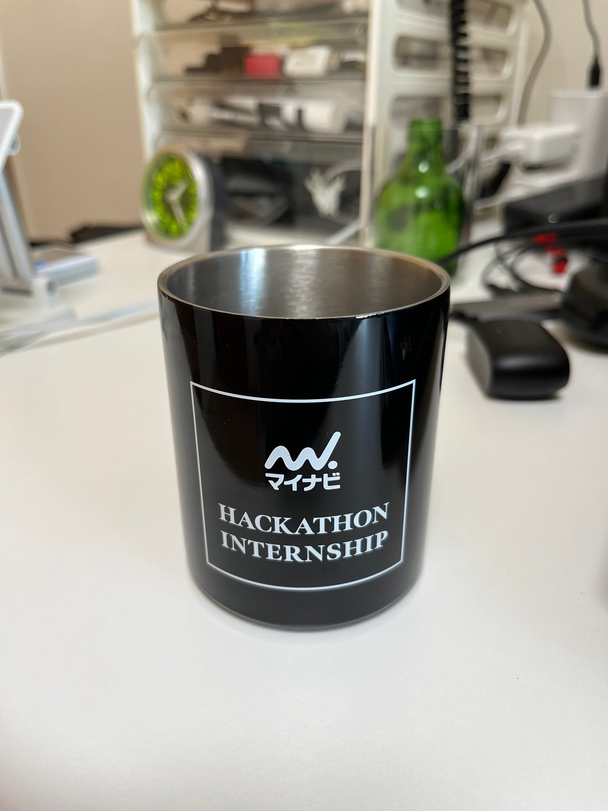

## はじめに

<blockquote class="twitter-tweet">
<a href="https://twitter.com/hashtag/%E3%83%9E%E3%82%A4%E3%83%8A%E3%83%93%E3%83%8F%E3%83%83%E3%82%AB%E3%82%BD%E3%83%B3?src=hash&amp;ref_src=twsrc%5Etfw">#マイナビハッカソン</a> <a href="https://twitter.com/hashtag/%E3%83%8F%E3%83%83%E3%82%AB%E3%82%BD%E3%83%B3?src=hash&amp;ref_src=twsrc%5Etfw">#ハッカソン</a> <a href="https://twitter.com/hashtag/%E3%81%BE%E3%81%84%E3%81%AA%E3%81%B3%E3%81%A6%E3%81%A3%E3%81%8F?src=hash&amp;ref_src=twsrc%5Etfw">#まいなびてっく</a> 左上の人として参加してました。優勝出来てよかったです。 チームメイト、メンター、そしてマイナビの皆様、8日間ありがとうございました！ <a href="https://t.co/ugT0KVgqPv">https://t.co/ugT0KVgqPv</a>
&mdash; omemoji (@omemoji_art) <a href="https://twitter.com/omemoji_art/status/1735580316537151591?ref_src=twsrc%5Etfw">December 15, 2023</a></blockquote>

株式会社マイナビが開催している「フルスタック開発プログラム」に参加し、**優勝**することが出来た。以下に体験談を記す。

## 株式会社マイナビについて

https://www.mynavi.jp/

会社全体については上記リンクを参照。

## 「フルスタック開発プログラム」について

https://web.archive.org/web/20230924201001/https://saiyou-org.www.mynavi.jp/saiyou/news/internship/2725

マイナビが開催しているインターンシップの内、《IT コース》の「フルスタック開発プログラム」に参加した。

### 概要

参加者は 3 チームに分かれ、架空の Web アプリケーションの機能改善・追加を行いそのクオリティを競い合った。
「フルスタック」の名の通り、インフラ選定・構築、バックエンドからフロントエンドまでアプリケーション全体の開発を体験した。
また、チーム開発におけるコミュニケーションや議論、作業の分担についても学ぶことが出来た。

### 期間

8 日間（2023/12/6 ~ 2023/12/15）

### 使用した技術

| Layer    | Tools                                    |
| -------- | ---------------------------------------- |
| Frontend | Next.js, TypeScript, Chakra UI , Emotion |
| Backend  | TypeScript, Prisma                       |
| Infra    | Docker, AWS, AWS CDK , GitHub Actions    |

## 過程

最初にインターンシップ全体の説明や環境構築を終えた後、以下の作業を行っていった。

### チュートリアル

チュートリアルの内容は、ハンズオン（個人作業）を終わらせた後いくつかの課題（チームで分担して行う作業）を実装するという形式だった。
筆者が担当した課題は最も難しい部分だったが、ハンズオンを参考にして実装していった。

### アプリケーションの改善・機能追加

1. どういった層をターゲットにするか、コンセプトは何か
2. 上記を達成するためにはどのような機能改善・追加を行えば良いか

について、チーム全員で議論を行った。
小さなことでも積極的に発言をするように心がけ、出来るだけ多くの意見が出るようにした。

### AWS

AWS の基礎的な知識について講義を行った後、AWS によるインフラ構成の検討を行った。
与えられた Web アプリケーションのインフラに存在するいくつかの問題点を踏まえ、それらをどのように解決するかという観点からリソースの選定を行っていった。

その後実際にインフラを構築し、

- AWS CDK を用いて TypeScript でインフラ構成を記述する
- デプロイのために GitHub Actions を設定する

などの作業をチーム全体で行った。

### 実装

前半に考えたアプリケーションの改善策、及び新機能を皆で実装していった。
自分のチームでは UI を変えるだけの簡単なものから機械学習を使った高度なものまで様々な機能を実装し、チーム全員で協力して作業を分担していった。

### 成果発表会

アプリ開発のまとめとして、スライドを交えたハッカソンの成果発表を行った。
各チームの成果発表が終わった後は、グランプリを取ったチームの発表とメンターからのフィードバックが行われた。

## 振り返り

### 開発について

8 日間という日程に対して、非常に濃密な内容だった。
フロントエンド分野で使用した Next.js については[このポートフォリオを作成するために使っていた](https://omemoji.com/articles/portfolio_renewal/)ので、意外とスムーズに開発を進めることが出来た。
一方、AWS を始めとしたインフラ構築やバックエンドでの DB の扱いは殆ど初めてだったため、理解や実装に時間がかかってしまった。
ただ、自分が慣れている分野以外も含めて Web アプリケーション開発全体を経験出来たのは貴重な機会だったと思う。

分からないことは積極的にチームメンバーやメンターに相談するよう心がけた。
「もっと早く相談してもよかった」というフィードバックをメンターから受けたので、今後も 15 分程度自分で考えて分からなければ誰かに相談するようにしたい。

扱う内容が自分にとっては少し高度だったためか、コードについて理解できない部分もいくつかあった。重要な内容であることは間違いないので、きちんと復習したい。

### チーム作業について

チーム開発の経験が少なく不安だったが、意外にも議論や役割分担をスムーズに行うことが出来た。

議論については「多くの意見を出して意見が出やすい状態にする」ことを重視したが、話が盛り上がりすぎて脱線しそうになったときに議論の方向性を戻す舵取り役の人がいてくれたのがありがたかった。
また、「個別の機能改善より先にコンセプトを固める」というように、何について話し合うべきかをその都度確認することが出来た。
こうした点に留意して議論を進めていったおかげで、明確なコンセプトや独自性の高い機能が提案されやすくなったと思う。

役割分担については、

- アプリ開発では、基本的にはそれぞれの機能の発案者がその部分を実装する
- それ以外では大体均等な負担で作業を行う

という形で作業が割り振られることが多かった。
チームのメンバーの中で特に技術力の高い人がいたので、その人には難しめの機能（機械学習を使う機能など）を割り振ったり開発時にリードしてもらったりした。
自分は技術的にはそこまで優れていたわけではないが、インフラ構成の技術選定理由を markdown でまとめるなど技術面以外でも何らかの形でチームに貢献出来るよう心がけた。

### グランプリを受賞して

難しい機能を皆で頑張って実装したので、努力の成果が出て嬉しい。

審査員の方からは「コンセプトの明確さ」が受賞理由として挙げられたが、[上](#チーム作業について)で述べたようにチーム内で円滑にコミュニケーションがとれる雰囲気を作ったことも理由の一つだと考えている。
裏を返せば、チーム内にどれほど技術力あるいは発想力に優れた人がいたとしても、チーム内で問題の共有・意見交換がスムーズにいかなければその能力を持て余してしまう可能性があるということも分かった。
そのため、今後のチーム開発においては技術面のみならずこうしたコミュニケーション面にも気を配っていきたい。

## 感想

- [チームラボのインターンシップ](https://omemoji.com/articles/teamlab)に引き続き、有意義な経験が出来たインターンだった。
  就活の一環として参加したが、個人開発についてもモチベーションを上げることが出来たと思う。

- バックエンドとデータベース操作を TypeScript で記述する方法（Prisma）を初めて知った。個人開発で一度使ってみたい。

- 記念品のマグカップは魔法瓶仕様になっていたので、季節柄愛用している。

## 最後に

チームメンバーとマイナビの皆様、8 日間という短い間でしたがありがとうございました！
