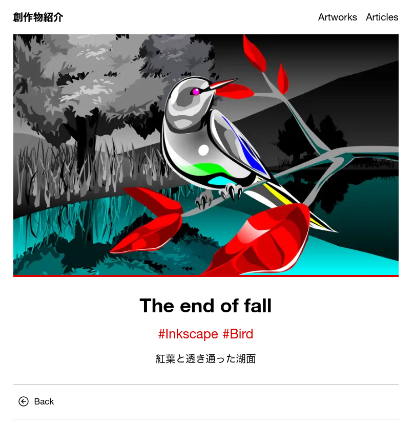
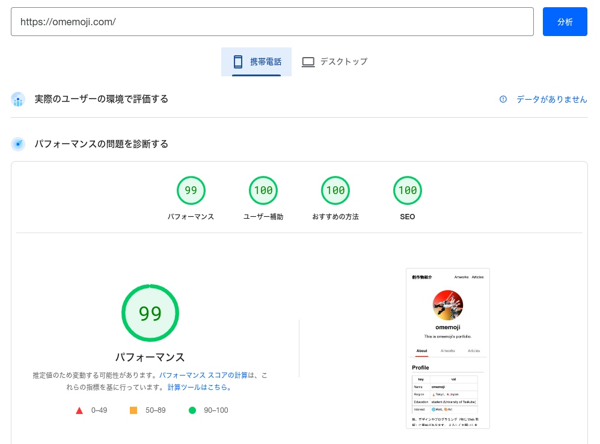

https://adventar.org/calendars/8938

[天久保 Advent Calendar 2023](https://adventar.org/calendars/8938) 19 日目の記事。

## はじめに

https://github.com/omemoji/omemoji.com

ポートフォリオを Next.js で書き直し、機能を改善することにした。

### 何故リニューアルするのか

当サイト「創作物紹介」は自分のプロフィール、絵や markdown で書いた記事を公開するポートフォリオである。最初は Nuxt.js で実装していたが、エコシステム及び情報の充実度、フレームワークの人気など様々な理由から Next.js で実装し直したいと考えるようになった。また、このサイトはコンテンツの更新や保守についてはそれなりに快適だったものの、大小様々な問題点を残していた[^1]。そこで、「創作物紹介」を作成してからちょうど 1 年が経過したということもあり、これを良い機会としてポートフォリオをリニューアル・改善することにしたのだった。

[^1]: カスタムコンポーネント（このサイトにおいてはリンクカードや画像最適化用コンポーネントなど）を使うときにそのタグを markdown ファイル内に直接書かなければならない、ページネーションに一切対応していない、リンクカードの画像を最適化出来ないため転送量が増加してしまう、など

### 使用した技術

- Next.js (Ver. 13.4, SSG)
- Tailwind CSS
- TypeScript
- Cloudflare Pages
- GitHub Actions

Next.js は app router を使用しており、ライブラリの兼ね合いからバージョンを 13.4 に留めている[^2]。ホスティングは Cloudflare Pages で行っている他、[GitHub のプロフィール](https://github.com/omemoji/omemoji)の更新時にデプロイが行われるように GitHub Actions を使用している[^3]。

[^2]: 主に next-export-optimize-images のせい
[^3]: [https://raw.githubusercontent.com/omemoji/omemoji/main/README.md](https://raw.githubusercontent.com/omemoji/omemoji/main/README.md) を `next-mdx-remote` で読み込むことで、 GitHub のプロフィールを「創作物紹介」のプロフィールに使い回せるようにしている

## 機能及び実装

### 作品を公開する

#### 1.作品一覧

https://omemoji.com/artworks

Instagram や Pixiv などのレイアウトを参考にしている。ページネーションも実装し、 1 ページあたり 9 つの作品が表示されるようになっている。

#### 2.個別作品ページ



レイアウトをすっきりさせるとともに、タグ機能を追加した。
また、作品のデータは `lib/data.ts` 内の配列で管理している。これにより、

1. `/images/artworks` に作品の画像ファイルを追加する
2. `lib/data.ts` 内の配列に作品の情報を追加する

だけでビルド時に作品ページをまとめて生成することが出来る。

```ts title="lib/data.ts"
export type artData = {
  slug: string;
  src: string;
  title: string;
  tag: string[];
  href: string;
  description: string;
};
export const artworks: Array<artData> = [
  {
    slug: "ink_drop",
    src: "/images/artworks/ink_drop.png",
    title: "Ink drop",
    tag: ["Krita", "Zugadan"],
    href: "https://www.instagram.com/p/Cy86MEcvrdo/",
    description: "水中に垂らされていく、金魚の形を成した墨滴",
  },
  // 中略
];
```

### 画像最適化

「創作物紹介」では数多くの作品の画像を扱うため、画像最適化は特に重要である。
Next.js における画像最適化の方法としては [next/image](https://nextjs.org/docs/pages/api-reference/components/image) が有名であるが、 next/image で画像を最適化するためには Node.js サーバー上でサイトを動かすか外部の画像プロバイダーを使う必要がある（つまり、ビルド時に最適化された画像を生成するわけではない）。
このポートフォリオはそれらを使わずに SSG で作成するため、 next/image の恩恵を受けられないということになる。

そこで、画像最適化ライブラリとして `next-export-optimize-images` を用いる。

https://github.com/dc7290/next-export-optimize-images

`next-export-optimize-images` を使うのは全く難しくない。
[いくつかの設定](https://next-export-optimize-images.vercel.app/docs/getting-started)を行った後普通に next/image を使うだけで、**ビルド時に**最適化された画像を生成してくれるようになる。また、

- 画像処理に [`sharp`](https://www.npmjs.com/package/sharp) を用いており、高速である
- キャッシュによって無駄に同じ処理を繰り返さない実装になっている

といった特徴があるようだ。

### Markdown の処理

https://github.com/hashicorp/next-mdx-remote

Next.js で Markdown を使って記事を書く場合は、 `next-mdx-remote` を使うのがおすすめである。
`next-mdx-remote` を使うことで、 `fs` や `fetch` で取得した markdown ファイルを JSX にコンパイル・変換することが出来る。
また、 コンパイル時にオプションをつけることで、

- `remark/rehype` プラグインを適用する
- 文書内の特定箇所をカスタムコンポーネントに変換する

といったことも可能である。

markdown ファイルを JSX にコンパイルする際、`next-mdx-remote` を用いて `compiler` 関数を作成しておくと便利である。

```ts title="lib/compiler.ts"
import { compileMDX } from "next-mdx-remote/rsc";
import remarkGfm from "remark-gfm";
import remarkGemoji from "remark-gemoji";
import rehypeSlug from "rehype-slug";
import rehypeAutolinkHeadings from "rehype-autolink-headings";
import MDXComponent from "components/MDXComponent";
import rehypeRaw from "rehype-raw";
import remarkUnwrapImages from "remark-unwrap-images";
import rehypePrettyCode from "rehype-pretty-code";
import { remarkLinkCard, linkCardHandler } from "lib/remark-link-card";
import remarkMath from "remark-math";
import rehypeKatex from "rehype-katex";
const compiler = async (source: string) => {
  const result: Promise<{
    content: JSX.Element;
    frontmatter: {
      emoji: string;
      slug: string;
      title: string;
      date: string;
      description: string;
      tags: string[];
    };
  }> = compileMDX({
    source,
    components: MDXComponent,
    options: {
      mdxOptions: {
        remarkPlugins: [
          remarkGfm,
          remarkGemoji,
          remarkUnwrapImages,
          remarkLinkCard,
          remarkMath,
        ],
        rehypePlugins: [
          [rehypePrettyCode, { theme: "monokai", grid: true }],
          rehypeSlug,
          [rehypeAutolinkHeadings, { behavior: "wrap" }],
          rehypeKatex,
          rehypeRaw,
        ],

        remarkRehypeOptions: {
          allowDangerousHtml: true,
          handlers: {
            linkCard: linkCardHandler,
          },
          footnoteLabel: "脚注",
        },
        format: "md",
      },
      parseFrontmatter: true,
    },
  });
  return result;
};

export default compiler;
```

#### Remark/Rehype プラグイン（一例）

GitHub Flavored Markdown を書けるようにするもの（`remark-gfm`）から Tex 記法で数式を書けるようにするもの（`remark-math, rehype-katex`）まで、様々なプラグインがある。

```md
**GitHub Flavored Markdown (GFM)**

| ある   | なし   |
| ------ | ------ |
| ロック | ジャズ |
| 語録   | 名言   |
| 肉     | 魚     |
| 葉っぱ | 根っこ |

- [x] 朝ご飯
- [x] 昼ご飯
- [ ] 夜ご飯

**gemoji**

:v: :grin: :hand:

**数式**

$$
\frac{4}{\pi} = \sum_{i=0}^{\infty} \frac{(-1)^n (4n)!(1123+21460n)}{882^{2n+1}(4^{n}n!)^4}
$$
```

**GitHub Flavored Markdown (GFM)**

| ある   | なし   |
| ------ | ------ |
| ロック | ジャズ |
| 語録   | 名言   |
| 肉     | 魚     |
| 葉っぱ | 根っこ |

- [x] 朝ご飯
- [x] 昼ご飯
- [ ] 夜ご飯

**gemoji**

:v: :grin: :hand:

**数式**

$$
\frac{4}{\pi} = \sum_{i=0}^{\infty} \frac{(-1)^n (4n)!(1123+21460n)}{882^{2n+1}(4^{n}n!)^4}
$$

### リンクカード

[Zenn](https://zenn.dev)などで使われているカード形式のリンクを作れるようにした。例えば

```md
https://www.google.com
```

というように単独でリンクを記述した場合、ビルド時に以下のようなカード状のリンクが生成される。 ⬇

https://www.google.com

リンクの検出やカスタムコンポーネントの書き方といった具体的な実装については、以下のサイトを参考にした。

https://zenn.dev/tomi/articles/2021-03-22-blog-card

https://zenn.dev/januswel/articles/745787422d425b01e0c1

https://www.haxibami.net/blog/posts/blog-renewal#%E3%83%AA%E3%83%B3%E3%82%AF%E3%82%AB%E3%83%BC%E3%83%89

#### メタデータの取得

ここでは、リンクカードの作成に必要な情報の取得について説明する。上のリンクカードを見てみると、

- サイトのタイトル
- サイトの説明
- 画像
- URL

の 4 つの要素で構成されていることが分かる。これらの情報を取得するためには、サーバーサイドでリンク先の HTML からメタデータ（title や OGP 画像など）を取り出す処理を行えば良い。例えば、

1. `fetch`で リンク先の HTMl を取得し、そのレスポンスを文字列に変換する
2. 変換した文字列を[`Cheerio`](https://github.com/cheeriojs/cheerio)で読み込んでそれぞれのメタデータを取得する

といった方法がある。

##### OGP 画像の最適化・埋め込み

外部サイトから取得した画像のリンクをそのまま貼った場合、画像のサイズが大きすぎて読み込みに時間がかかる場合がある。そのため、取得した画像は base64 形式に変換・最適化した後 HTML に直接埋め込むようにしている。ここでは画像最適化に [`sharp`](https://www.npmjs.com/package/sharp) を使っており、リサイズと webp フォーマットへの変換を行っている。実装は以下のサイトを参考にした。

https://www.haxibami.net/blog/posts/blog-astro-renewal#1-%E3%83%AA%E3%83%B3%E3%82%AF%E3%82%AB%E3%83%BC%E3%83%89%E5%86%85%E3%81%AE%E7%94%BB%E5%83%8F

### デプロイ

Cloudflare Pages の無料プランでホスティングしている。以前は GitHub Pages を使っていたが、ドメインを Cloudflare で管理しているためホスティング全体を Cloudflare で完結させることにした。

以下のリンクに従って Cloudflare Pages と GitHub リポジトリ を連携させることで、リポジトリの更新時に自動デプロイが可能となる。
GitHub Pages と比較すると、設定が楽[^4]だったり商用利用が可能[^5]といったメリットがある。

[^4]: GitHub Pages の場合、自動でデプロイするために GitHub Actions の workflow を書く必要がある
[^5]: 今の所予定はない

https://developers.cloudflare.com/pages/get-started/guide/#connect-your-git-provider-to-pages

#### Deploy Hooks

https://developers.cloudflare.com/pages/platform/deploy-hooks/

API を叩いてデプロイさせることが出来るらしい。
これにより、[GitHub のプロフィール](https://github.com/omemoji/omemoji)の更新時に GitHub Actions で Deploy Hooks の API を叩いて再ビルドさせ、「創作物紹介」のプロフィールも同時に更新することが出来るようになった。

## 感想



[Google PageSpeed Insights](https://pagespeed.web.dev/analysis/https-omemoji-com/) で殆ど満点を取ることが出来た[^6]。コンテンツ管理・保守についても以前より更に楽になり、もはや Zenn や Qiita などと遜色ない書き心地で記事を書けるようになった。
来年も積極的に作品や記事を公開していきたい。

[^6]: パフォーマンスについては以前からこのくらいの点数だったが、「おすすめの方法」の点数なども向上した

### Next.js に変更してみて

Nuxt.js から Next.js にフレームワークを変更した結果、利用者数に伴う情報量の多さやライブラリの多さが特に魅力的だと感じた。
Next.js の場合

- リンクカードを実装する
- markdown 内で特定のノードをカスタムコンポーネントに変換する
- リモートの markdown ファイルを取得・処理する

などある程度複雑なことでもライブラリや実装例が探しやすく、作業を楽に進めることが出来た[^7]。

[^7]: 恐らく Nuxt.js でも工夫すれば似たようなことは出来る

### 改善点

目下の改善点として、

- もう少しデザインを凝る
- 作品や記事ページの OGP 画像をいい感じに生成する
- RSS 対応
- 記事の目次
- 閲覧者数の増加[^8]

などに着手していきたい。

[^8]: これはサイト自体というよりコンテンツの充実度やコミュニケーション・広報の問題だと思われる

## 備考

### 以前の実装

https://zenn.dev/omemoji/articles/41c1bd8a69ebce

Nuxt.js による実装はこちらを参照。
