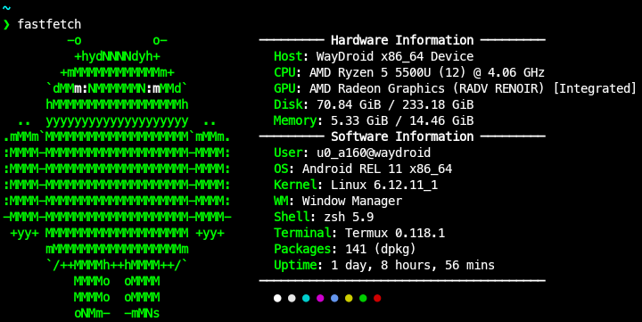

## はじめに

Amazon Kindle は、 公式の Linux 向けデスクトップアプリが存在しない[^1]。
現代の読書生活において Kindle が使えないのは致命的であるため、何とかして Linux 環境で Kindle を動かせるようにしたい。

結論から言うと、 [Waydroid](https://waydro.id/) を用いて Linux 上で Android 版の Kindle を実行することにした。
本記事では Waydroid を導入する方法、及びその上で Kindle を動かすための手順について説明する。

### （余談）何故 Android 版なのか？

Linux 上で Kindle を実行する方法としては、以下の 3 つが考えられる。

1. Kindle Cloud Reader（Web 版の Kindle）を使う
2. Wine で Windows 用のデスクトップアプリを動かす
3. Android 用のモバイルアプリを（仮想環境などを用いて）Linux 上で動かす

1 は最も簡単な方法だが、読み込みに時間がかかる上に一部閲覧出来ない本があるなど問題点が多い。
そこで 2 あるいは 3 の方法をとるわけだが、2 は却下された。
文字化けしたり上手く動かなかったりして導入出来なかったのもあるが、そもそも PC 版の Kindle はモバイル版よりも使いづらいからである[^2]。
そのため、必然的に Android 版のものを動かすこととなったのだった。

[^1]: Windows と macOS のみに対応している。なお、モバイルアプリでは Android と iOS の両方に対応している
[^2]: 例えば、漫画の単行本をシリーズごとに自動でまとめてくれない

## Waydroid

### 概要

https://github.com/waydroid/waydroid

Waydroid は、 Android システムを Linux 上のコンテナ内で動かすためのソフトウェアである。
カーネルをホストマシンと共有することでハードウェアに直接アクセス出来るため、他の Android エミュレータ・仮想環境より高いパフォーマンスを実現している。
実際の使用感としても、もはやネイティブアプリと遜色ない軽快さで動作してくれる。



### インストール

[こちら](https://docs.waydro.id/usage/install-on-desktops)のドキュメントに従ってインストールする。
主要なディストロであれば問題なくインストール出来るが、ディスプレイサーバーは **Wayland でなければならない**[^3]。

### 初期設定

まず、`waydroid-container.service`を起動・有効化出来ているか確認する（`systemd`を使っている場合）。
その後、

```sh
sudo waydroid init
```

で Android イメージをインストールする。この時点では GApps を入れる必要はないので、VANILLA イメージを選択する。

[^3]: X11 でも`weston` を使えば動かせるらしいが、試してはいない（参考：[https://arimasou16.com/blog/2022/07/17/00469/](https://arimasou16.com/blog/2022/07/17/00469/)）

### （参考）Void Linux によるインストール

```sh
# インストール
sudo xbps-install -S waydroid
# runit でサービスとして起動・管理出来るようにする
sudo ln -sv /etc/sv/waydroid-container /var/service/
# 初期設定
sudo waydroid init
```

## GAPPS 及び ARM への対応

これで Waydroid 上で Android を動かせるようになったが、これだけでは Kindle を動かす上で十分ではない。
何故なら、この Android システムは Google Play Store がインストールされていない上にアーキテクチャも x86_64 だからである[^4]。
よって、以下の手順に従いこれらの問題を解決する。

### 必要なものをインストールする

以下のスクリプトを使う。

https://github.com/casualsnek/waydroid_script

```sh
git clone https://github.com/casualsnek/waydroid_script
cd waydroid_script
python3 -m venv venv
venv/bin/pip install -r requirements.txt
sudo venv/bin/python3 main.py
```

で対話型インターフェースを起動した後、`Android 11 -> Install`と進んで`gapps`と`libhoudini`（CPU が AMD の場合には`libndk`）をインストールする。
`gapps`はカスタム ROM で Google Play Store を利用出来るようにするためのものである。
また、`libhoudini`（`libndk`）は x86_64 Android - ARM 間の翻訳レイヤであり、ARM 対応はこれを用いて行っている。

### デバイスを Google に登録する

Google Play Store を利用するためには、自分のデバイスを Google Play Protect に認証してもらう必要がある。

```sh
sudo waydroid shell
```

で Waydroid のシェルに入った後、

```sh

ANDROID_RUNTIME_ROOT=/apex/com.android.runtime ANDROID_DATA=/data ANDROID_TZDATA_ROOT=/apex/com.android.tzdata ANDROID_I18N_ROOT=/apex/com.android.i18n sqlite3 /data/data/com.google.android.gsf/databases/gservices.db "select * from main where name = \"android_id\";"
```

を実行して Android ID を取得する。
その後 [https://www.google.com/android/uncertified/](https://www.google.com/android/uncertified/)でその ID を入力し、デバイスを Google に登録する。
登録には少し時間がかかる。

[^4]: Google Play Store で配信される多くのアプリは ARM 用のものである

## おわりに


これで Amazon Kindle を Google Play Store からインストールし、起動出来るようになったはずである。
仮想化されていることを感じさせないほどにサクサク動く Kindle とともに、Linux でも便利な読書生活を楽しんでしまおう。
また、他の Android アプリをインストール・実行してみるのも面白いかも知れない[^5]。

[^5]: ただし、アプリケーションの規約に違反しないよう注意する必要がある

## 参考

https://wiki.archlinux.jp/index.php/Waydroid

https://www.haxibami.net/blog/posts/linux-waydroid-18
