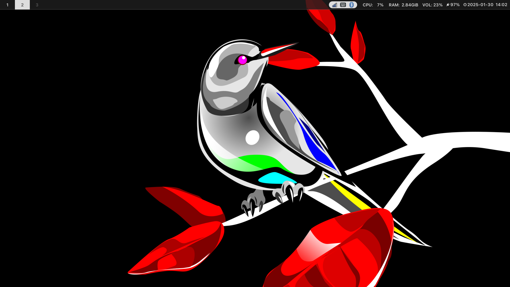

{/*  */}

## はじめに

"void in one's life" は「人生の空虚さ」と訳すことが出来る。しかし、「空」の名を冠する Linux ディストリビューション「Void Linux」のある生活は空虚さとは無縁である ── シンプルで、堅牢で、持続可能で、何より手に馴染む。それはむしろ、快適かつ有意義な環境を使用者にもたらすだろう。

2023 年 7 月に Void Linux を使い始めてから大体 1 年半が経過し、Void Linux の扱いにも慣れてきた。そこで、Void Linux を使うようになった経緯、実際に Void Linux を普段使いして感じたことや Tips などをここに記す。また、この記事を読んで Void Linux に魅力を感じてくれたなら、是非インストールして愛用してほしいと思う。

## 基本情報

https://voidlinux.org/

[過去の記事](https://omemoji.com/articles/void_linux)と被るが、一応 Void Linux の基本的な情報とインストール方法を記す。

- 既存のものの派生ではない、独立した Linux ディストリビューションである
- ローリングリリース[^4]
  - パッケージについては、最新であることよりも安定性を重視している
- デフォルトの init / サービス管理システムとして `systemd` ではなく `runit` を用いる
- C 言語ライブラリとして glibc と musl の 2 種類を採用
- [XBPS](https://github.com/void-linux/xbps) という独自に開発されたパッケージマネージャを用いる
- [xbps-src](https://github.com/void-linux/void-packages) という Arch Linux における [AUR](https://wiki.archlinux.jp/index.php/Arch_User_Repository) のようなシステムがある

インストールについては下記を参照。TUI ベースのインストーラを使うので、英語さえ読めればそこまで難しくない。

https://note.kurodigi.com/voidlinux-uefi-install/

## Void Linux の長所と短所

ここでは、Void Linux を実際に普段使いして感じた長所と短所を記す。

### :+1: 長所

#### システムの安定性を損なわないローリングリリース

実際に使ってみて、「安定したローリングリリース」が最大の、そして唯一無二の長所だと感じた。現在ローリングリリース方式を取るディストロの多くはソフトウェアの新しさを重視しているため、その分依存関係などの面でシステムが不安定になることが多い。しかし、「ローリングリリースを採用しつつ、多少パッケージが古くなってでもシステムを安定させる」という方針もあり得るはずである。Void Linux はその方針に従った数少ないディストロであり、「Windows や Ubuntu などのように大規模なシステム更新にも気を配らなくていいし、しかもバグも少ない」という独特かつ快適な使用感を実現している。

#### 起動が速い

やたら起動が早く、ブートローダで OS を選択してから数秒でログイン画面に移ることが出来る。`systemd`の代わりに`runit`を用いているからだろうか？

#### ドキュメントが優秀

https://docs.voidlinux.org/

ドキュメントの出来はディストロ自体とは関係ないかも知れないが、必要十分な情報と構造の明快さを両立している優れた手引書としてここに特筆する。分からないことはここと[Reddit](https://www.reddit.com/r/voidlinux/)を調べれば大体分かる（ただし、**ほぼ全ての情報は英語である**）。

#### 特別感が得られる

いささか冗談めいているが、「特別感」についても意外とバカにならない。前提として、Void Linux は非常にマイナーなディストロである[^1]。ただでさえ Linux をデスクトップ用に普段使いしている人は少ないのだから、その中で Void Linux を使う人はもはやツチノコと同じくらい希少な存在だろう。[Arch Linux を普段使いするオタクがいるようなコミュニティ](https://www.coins.tsukuba.ac.jp/)であっても Void Linux ユーザーはまず間違いなく驚かれ、存在感を発揮出来るはずである。

[^1]: この記事で初めて存在を知った人も相当数いるのではないだろうか

### :-1: 短所

#### 情報が少ない

ドキュメントは優れているものの、使用者数の関係上それ以外の情報はかなり少ない。日本語の情報は特に少なく、そもそも日本語版の Wikipedia 記事さえ存在しない ── 検索しても、いくつかの個人ブログがヒットするのみである[^6]。また、後述する通り Void Linux は他のディストロと異なる点が多いので、この問題はより深刻なものになる。

[^6]: ただし、それらの数少ないブログの内容はどれも有益で非常に助けられた

#### パッケージが微妙に足りない、または古いことがある

安定性を重視している以上仕方ないが、Arch Linux のように「常に最新のパッケージを使用」とはいかない。とはいえ実用に支障をきたすほど古いことはほぼないし（Ubuntu や Debian よりは十分新しい）、void-packages や flatpak など対応策はある。

#### 独自色が強すぎる

Void Linux は非常に癖が強い。パッケージマネージャは xbps というオリジナルのものを使っているし、システムマネージャとして`systemd`ではなく`runit`を用いている。他のディストロの知識を使い回せない場面が多いため、最初は情報の少なさと合わせて苦労するかも知れない。しかし、この記事をわざわざ読むような人は Linux の基本的な使い方は分かっているだろうから、Void Linux の独自要素に慣れさえすればなんとかなるだろう。

## 他ディストリビューションとの比較

### Arch Linux

ローリングリリースやカスタマイズ性・simplicity の高さなど Void Linux と共通する点が多く、恐らく Void Linux と最も比較されやすいディストロであろう。
本記事を読んでいる人の中にも、 Arch Linux からの乗り換えを検討している人がいるかも知れない。

Arch Linux と比較した Void Linux のメリットとしては、

- パッケージが新しすぎず、システムが安定しやすい（これは欠点とも言える）
- インストールが比較的楽
- 複数のアーキテクチャに対応している

といった点が挙げられる。一方、Arch Linux を使うメリットとしては

- （AUR を含めれば）圧倒的に使えるパッケージ数が多い
- 日本語英語問わず情報が充実している

などが挙げられる。
どちらを使うかは、「システムの安定性」と「最新かつ豊富なパッケージ」のどちらを優先するかで決めればよいだろう。

### Debian

デスクトップ環境無しでインストール出来、かつシステムの安定性が非常に高いディストロである。
ただしその代償として、パッケージがかなり古く普段使いに支障をきたすことがある。

### Ubuntu (Server)

Void Linux を使うようになるまでは、筆者は「安定性を重視しており、かつカスタマイズ性の高いディストロ」として Ubuntu Server を用いていた。
Debian よりはパッケージが新しいし、必要であれば PPA を用いて最新のアプリを入れられたからである。
これは意外にも悪くない選択肢であり、実際ローリングリリースがないこと以外は概ね不満なく使えていた（逆に言うと、「この使用感でローリングリリースを採用したディストロを使いたい」というのが Void Linux に出会ったきっかけである）。

### Solus

## Tips

### XDEB

**xdeb**は、`.deb`（Debian パッケージ）ファイルを`.xbps`（Void Linux パッケージ）ファイルに変換し、インストールするためのツールである。

https://github.com/xdeb-org/xdeb

xdeb の使い方は簡単で、上記リンクを参考にしてインストールした後

```sh
xdeb -Sedf <package>.deb
```

とすればよい。これだけで、

- 依存関係リストの同期
- 空のディレクトリの削除
- 依存関係の衝突の解決

を自動的に行った上で deb パッケージをインストールしてくれる。
よく使うソフトについては、まとめてアップデートするためのシェルスクリプトを書いてもよいだろう。

```sh title=my-xbps
#!/bin/bash
set -eu
TEMP_DEB="/home/$(whoami)/Downloads/deb"
PKG_LIST="/home/$(whoami)/dotfiles/pkg/my-xbps.txt"
NUMBER_OF_LINES=$(cat $PKG_LIST | wc -l)

for i in $(seq 1 $NUMBER_OF_LINES); do
    URL=$(sed -n "${i}p" $PKG_LIST)
    FILE_NAME="tmp_${i}.deb"
    wget -O $TEMP_DEB/$FILE_NAME $URL
    xdeb -Sedf $TEMP_DEB/$FILE_NAME
    rm -f $TEMP_DEB/$FILE_NAME
done
```

このとき、`my-xbps.txt`は以下のように書けばよい。
例えば、筆者は Google Chrome と Visual Studio Code[^7]を xdeb でインストールしている。

```txt title=my-xbps.txt
https://dl.google.com/linux/direct/google-chrome-stable_current_amd64.deb
https://code.visualstudio.com/sha/download?build=stable&os=linux-deb-x64
```

[^7]: 公式リポジトリの`vscode`パッケージでインストール出来るのは Code - OSS と呼ばれる OSS 版であり、一部の拡張機能を使うことが出来ない

### Wayland

Void Linux に特有の要素ではないが、Void Linux の GUI 環境を構築する上で重要なのでここで説明を行う。

https://docs.voidlinux.org/config/graphical-session/wayland.html

#### 日本語入力

## おわりに

インストール用の live イメージはこちらから。デスクトップ環境なしでインストールしたい場合、`base`を選択する。

https://voidlinux.org/download/

また、コンテナも用意されている。基本的には`void-glibc-full`を使えば良い。

https://github.com/void-linux/void-containers
