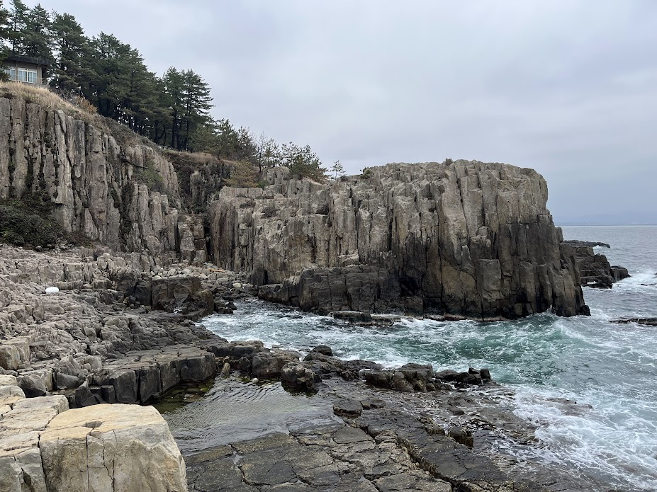
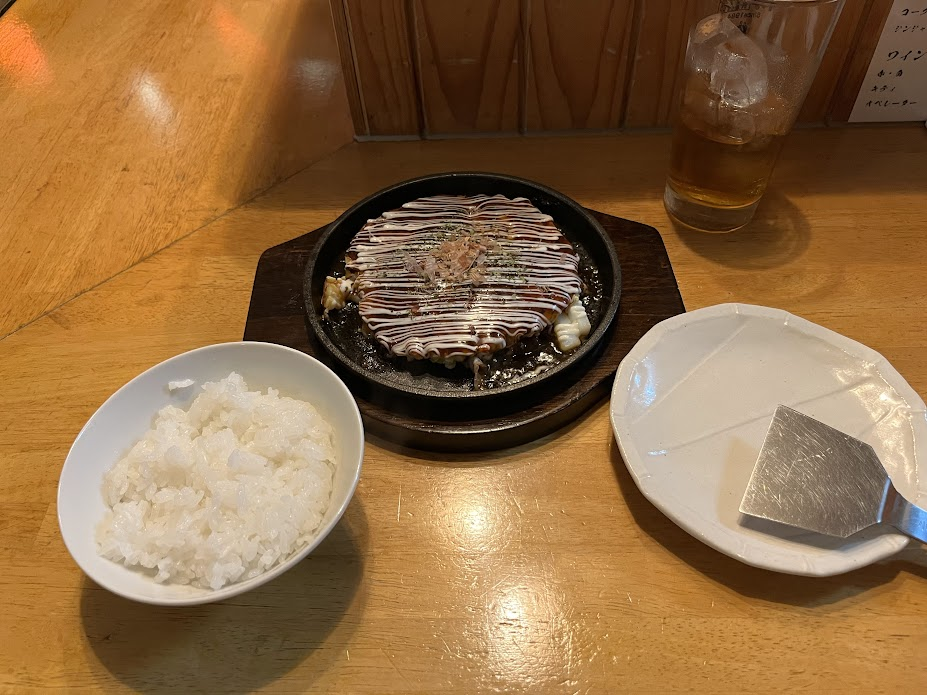
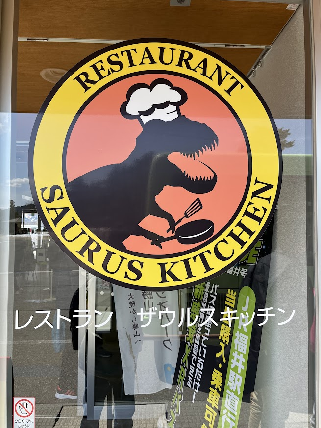

## はじめに

卒業、そして別れの季節である。筆者もこの度（2025 年 3 月 25 日）筑波大学を卒業することが出来た ── ただし、4 年ではなく 5 年で。ともかく大学生としてのイベントは卒業旅行を残すのみとなったのだが、一つ問題があった。**同期の殆どはストレートで大学を卒業した**ため、卒業旅行に誘う相手がいないのである。かくして筆者は、卒業旅行と称して気ままな一人旅を楽しむことにするのだった。

## 旅行の概要

### 日時

- 2025-03-28 (金) ~ 2025-03-29 (土)

### 場所：何故福井なのか？

最初は海外（台湾）に行って故宮博物院を見に行こうと思っていたが、旅行計画を立てるのが遅く旅費が高額にならざるを得なかったため断念した。そこで国内旅行に目を向け、

- 1 泊 2 日で十分楽しめそう
- 温泉がある
- 美味しいものが食べられる
- 面白い展示がある（恐竜博物館）

という理由から福井旅行をすることにした。

### 旅行プラン

https://www.jre-travel.com/article/00043/

基本的にはこれに従っている。車なしで回れるのが良かった。

## 1 日目

### 出発

北陸新幹線を使うと、東京駅から福井駅までちょうど 3 時間ほどで行ける。
福井で過ごす時間を長くしたいため、朝 6 時代にはもう新幹線に乗るようにした。

家で朝食を食べる時間がなかったので、駅弁の深川めし（1100 円）を購入した。

移動中の音楽としてはこれを聞いていた。旅情あふれる名盤である。

https://open.spotify.com/intl-ja/album/1h1ri4sAJx6N8ONpz1MYgk?si=i3mitWJ0RkuAIbRTpf2PDQ

### 福井駅

恐竜の化石の一大産地であるためか、JR 福井駅には恐竜を模したオブジェが大量にある。
写真のティラノサウルスは人が近づくと咆哮したり首を動かしたりする仕組みになっており、かなりの迫力があった。

### 東尋坊

単に景勝地として見応えがあったというだけでなく、予想以上にエキサイティングで面白い観光地だった。
というのも、この東尋坊には**安全柵の類が存在しない**。
そのため、（撮る写真の構図もよるが）ただ写真を撮っているだけなのに転落と隣合わせのスリルを味わえる。
柵がないおかげで景観が守られているという面もあり、今どき珍しい「ユーザーを全面的に信用している」場所だと思った。

#### 昼食

https://www.tojinbo.co.jp/shopping/archives/15

東尋坊の散策で腹を空かせた後、昼食は「やし楼」の海鮮丼を食べた。ネタが新鮮（特に鯛とタコ）な上にそれなりの量の蟹やいくらが入っており、値段以上に満足出来る一品だった。

### あわら温泉「芦湯」

https://www.fuku-e.com/spot/detail_1589.html

東尋坊の後は、あわら湯のまち駅周辺の温泉街を散策した。
あわら温泉「芦湯」では、無料で様々な泉質の足湯を楽しむことが出来る。東尋坊を散策した後の足の疲れを、一気に癒やすことが出来た。

### セントピアあわら

https://awara-saintpia.jp/

600 円で温泉に入ることが出来る。露天風呂に入り、フルーツ牛乳を飲んで完全に体力を回復した。

### 湯けむり横丁

https://yukemuriyokocho.com/

「湯けむり横丁」では牛ホルモンから海鮮に至るまで、様々な屋台が並んでいる。
飲み屋街としての性質も持っており、色々なお店で飲み比べをしても楽しめるだろう（筆者は体質上アルコールに非常に弱いため、お酒は飲まなかった）。
筆者はまずお好み焼きを食べた後、はしごして締めのラーメンを食べて夕食とした。

### 福井マンテンホテル駅前

https://www.manten-hotel.com/fukui/

JR 福井駅西口から徒歩 1 分。朝食付きの上夜食としてラーメンを無料で提供しており、ゆったりとくつろぐことが出来た。

## 2 日目

### 福井県立恐竜博物館

https://www.fuku-e.com/spot/detail_1193.html

この福井旅行で筆者が最も楽しみにしていたものの一つ。小さい頃から恐竜図鑑には慣れ親しんでいたのだが、実際に組み上げられた化石を目の当たりにするとその威容に改めて圧倒された。
これほどの\{巨|おお\}いなる存在がかつて地球上を闊歩していたと思うと、畏敬の念、あるいは一種の神性さえ感じられるほどである。

昼食については、「ザウルスキッチン」で特製カレーを食べた。非常に混んでいるため、注文する前に席を決めておくことをおすすめする。

### ポケモン化石博物館

https://www.dinosaur.pref.fukui.jp/special/pokemon/

ゲーム『ポケットモンスター』シリーズと恐竜博物館のコラボとして、「ポケモン化石博物館」という巡回展が開催されていた。
当然ながらカセキポケモンはフィクションの存在であるが、科学考証と作中設定を上手くすり合わせた上でリアリティのある骨格再現を行っているのが面白かった。

おみやげとして、「発掘ピカチュウ」のぬいぐるみを買った。会場で入場券を見せると手に入るチケットと交換した上で購入する必要があり、「1 人 1 個まで」というルールを徹底している様子が伺えた。

### 福井駅、そして帰京

https://tabelog.com/fukui/A1801/A180101/18009734/

夕食としてステーキ丼を食べ、2 日間たっぷり福井を楽しんだ満足感とともに東京行きの新幹線に乗った。

## 感想

- 「[新幹線 e チケットサービス](https://www.eki-net.com/top/jrticket/guide/reserve/ic_link.html)」により、チケットを現地で買うこともなくスマホひとつで乗車することが出来た。
  便利な時代になったものである。
- 自分で旅行の手続きを全て行うのは殆ど初めての経験だったが、大体予想通りのスケジュールで旅行を完遂出来て良かった。
  手続き系の作業は非常に苦手とするところだが、社会人になるとそういう機会も増えてくるので良い練習になったと思う。
- ご当地 T シャツやおみやげなどを買うためについつい財布の紐が緩んでしまい、予想以上にお金を使ってしまった。来月は節約したい。
- 社会人になるとまとまった休日をとるのが難しくなるが、今回のように 1 泊 2 日なら週末を使って楽しめるので今後も旅行に挑戦していきたい。

## おわりに

次の旅行では、リベンジとして台湾に行ってみたい。
