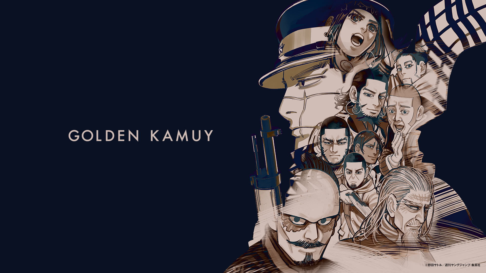
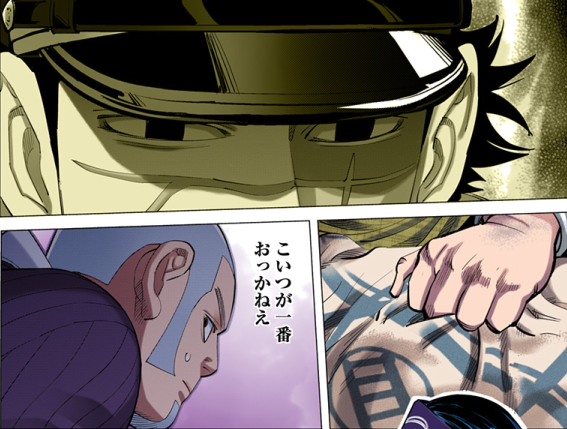
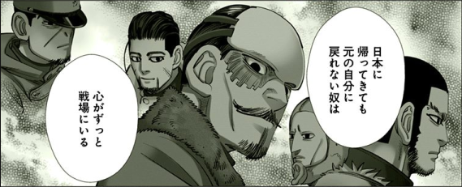
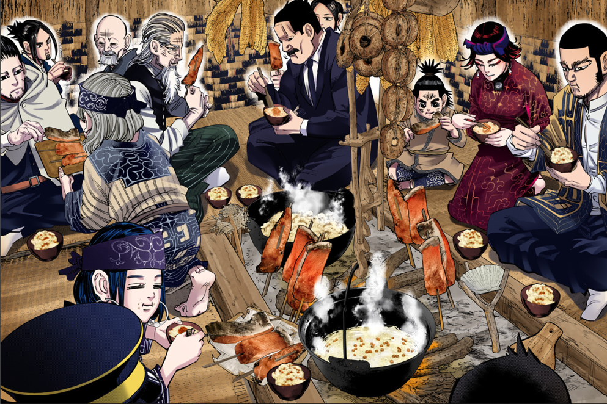
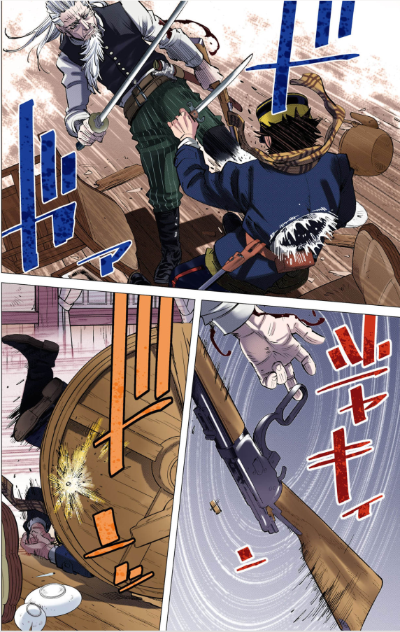
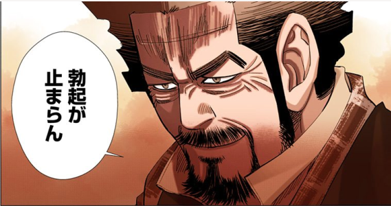
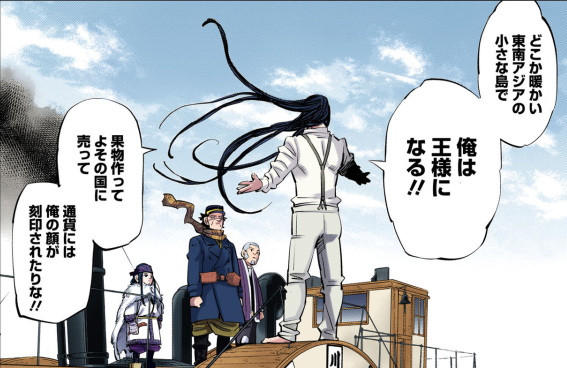
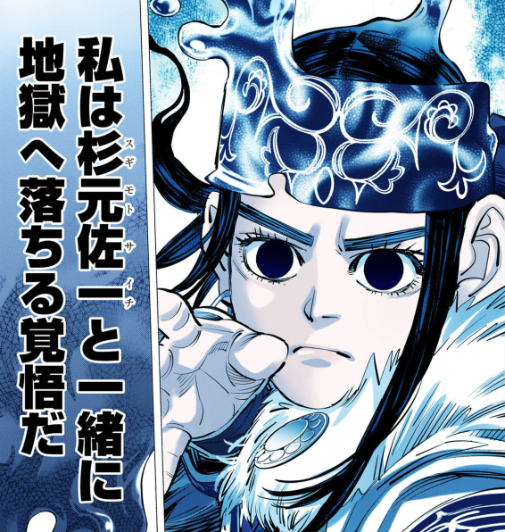
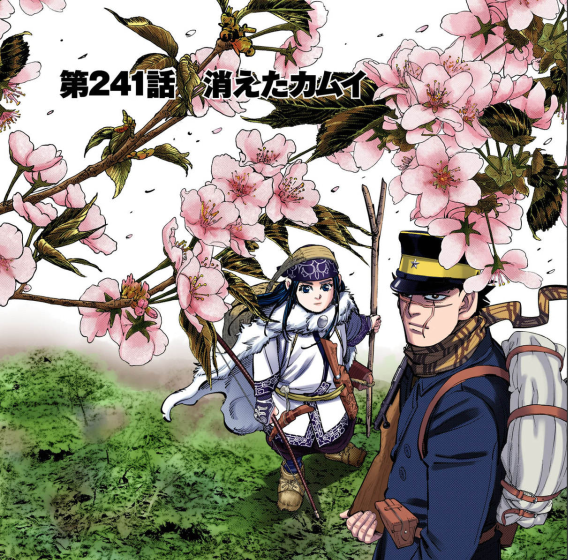
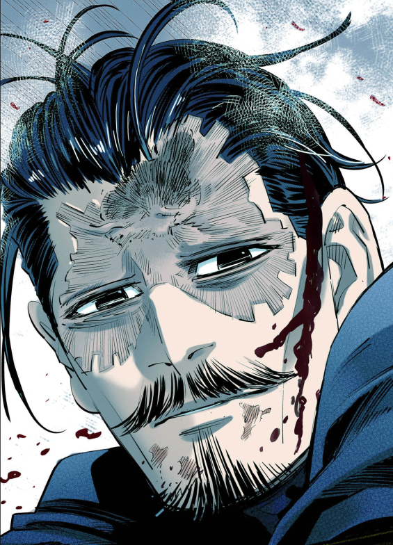

## はじめに

https://youngjump.jp/goldenkamuy/

この記事では、野田サトルによる漫画『ゴールデンカムイ』を読んで思ったことや考察などを記す。なお、[#感想・考察など](#感想考察など) 以降の項はネタバレに関して一切配慮していないので注意されたし。

## あらすじ

## 本作の魅力

### 骨太かつロマン溢れるストーリー

### 欲望と信念が織りなす人間讃歌

本作の登場人物の多くは「悪人」である ── 自らの望みを叶えるべく殺し、奪い、生きている。
故に本作では、キャラクター達の暴力的な欲望と変態性が全編にわたって遺憾なくぶちまけられている。
例えば…否、もはや異常者でないキャラを挙げた方が早いくらいだろう。『ゴールデンカムイ』は本当にそういう作品なのだ。

では「真っ当な」人間心理の描写は不十分なのかと言われれば、むしろその逆である。
戦友、民族、国、あるいは自分自身のため…。
本作の登場人物は皆譲れない理由を持って金塊争奪戦に参加しており、それぞれの信念がそのまま各キャラクターの魅力につながっている。
また、本作は決してエログロナンセンスを無思慮に撒き散らして良しとする作風ではない。
例えば「殺人による罪悪感」は本作のメインテーマの一つとなっており、それに対する苦悩や向き合い方も切実さと迫力をもって描かれている。

{/*  */}

『ゴールデンカムイ』はそれぞれのキャラが自分の信念や業を抱えながら、金塊争奪戦の中で自分の居場所や役目を見つけていく物語である。
美と醜、聖と俗、真と偽、善と悪。
矛盾する二つを併せ持つのが人間だとするならば、本作は正しく「人間」を描ききった作品と称されるにふさわしい。

### 高い画力と表現力

意外と言及されることが少ないが、『ゴールデンカムイ』はとにかく絵が上手い。
具体的に言うと絵の表現力が非常に高く、「イラストによって物事を説明する」という漫画の基本を忠実に守っている。
ここでは 2 枚の画像を例にして、その「上手さ」を説明する。

例えば、本作では北海道や樺太の大自然、生き物や少数民族の文化が丹念に描写されている。
そうした描写の説得力を支えるのが繊細かつ正確な筆致で描かれた絵であり、まるで図鑑のような緻密さとリアリティを誇る。
特に食事のシーンなどは、見ていると実際に腹が減ってくるほどだ。

一方、ゴールデンカムイは激しい動きの描写も巧い。上の画像は土方 vs. 杉元のバトルシーンであるが、その迫力もさることながら

1. 土方が杉元の胸部に強い蹴りを食らわす
2. 杉元と距離が離れた隙に土方が銃をリロードする
3. 吹っ飛ばされた勢いを使って杉元はテーブルの裏に転がり、土方の射撃を遮る

という複雑な動作の流れが一目瞭然[^action]である ── そこには余分なコマも、不足しているコマもない。

以上の 2 つの画像は、それぞれ「静」と「動」という点で対照的なシーンである。その一方のみならず両方を高いレベルで描けているという点において、本作の「絵の上手さ」は卓越していると言えるだろう。

[^action]: 余談だが、漫画においてアクションの「分かりやすさ」が表立って褒められることは少ない。その上手さは「描写の巧拙を**意識することなく**するする読める」という形で現れるからだ ── 意地悪な言い方をすると、アクションは下手であればあるほど目立つのである

## 感想・考察など

以下、最終巻までのネタバレを含む。

### 好きなキャラクター

挙げればキリがないが、ひとまず 3 人紹介する。

#### 1. 二瓶鉄造

個人的に、『ゴールデンカムイ』の中で最も達観した視点を持つ人物だと考えている。

> 人間を殺せば悪い神になって地獄に落ちるというやつか… \
> 安心しろ　人間なんぞにそこまで価値はない

という台詞は、本作を象徴する人間観にも思える。

#### 2. 海賊房太郎

#### 3. アシㇼパ

サバイバルの知識と冷静な判断力で主人公を助けつつ、餌付けと変顔を欠かさない最高のヒロイン。
罪業にまみれた本作の登場人物の中では極めて善良であり「光」と形容されることもある彼女であるが、個人的には彼女の「俗」や「悪」の面にも注目したい。
好きな人に近づいた女を妬むこともあるし、愛する者を守るためなら敵を殺すことも出来る。
偶像じみた完全なる善人ではないからこそ、その根本的な真っ当さ、知性~や面白さ~が一層魅力として輝くのだと思う。

### 印象的なシーン

#### 杉元・アシㇼパとカリンパニ（エゾヤマザクラ）

ゴールデンカムイで一番美しい一枚絵だと思う。
桜は出会いと別れの双方を象徴する花[^sakura]であり、二人の関係性が変わっていくことを暗示しているようにも見える（アシㇼパが杉元と梅子の関係を詳しく知ったのもこのときである）。
結局最終話でも二人が別れることはなく、一緒に暮らすようになったのだが。
[^sakura]: ただし、エゾヤマザクラが満開になるのはゴールデンウィークの時期なので入学式とも卒業式とも被っていない

#### 家族の指の骨が砕け散ったのを眺める鶴見中尉

「鶴見篤四郎」の本質を台詞すらない 1 コマで表現してしまった、野田サトルの恐るべき表現力が光る 1 コマ。
妻子の骨ではなく権利書を優先したことも、落ちていく骨を潤んだ目で見つめていることも、全てが鶴見という男の偽らざる一面である。
また、以上の葛藤を知る人物は**作中に一人も存在しない**のも面白い。
鶴見劇場を最前列の特等席で見ることが出来たのは、実は読者だったのかも知れない。

### 「狼」というモチーフが表すもの

### 最強キャラランキング

キャラクターの強さを比較するタイプの漫画でないことは百も承知だが、土方歳三に倣い筆者はこう言いたい ── _いくつになっても男子は強さ議論をするのが好きだろう？_

#### 選定基準

極めて主観的な基準なので、異議がある人は是非自分だけの最強キャラランキングを作ってみてほしい（コメントお待ちしています）。

- 1 対 1 での強さを比較する
- 武器は何でもよいが、個人で運用可能な規模のものに限る
  - これにより、マンスールや鯉登平二はランキング圏外となる
- キャラクターの性格を考慮する
  - 自分の意志でパワーを制御出来ない松田平太や、殺人を忌避するアシㇼパなどはその分戦闘能力を差し引いて考える

#### 🥉 第 3 位：尾形百之助

『ゴールデンカムイ』は（一応は）現実世界をベースとした歴史漫画なので、銃で頭を撃ち抜けば人は死ぬ。
そのため遠距離射撃が得意な人間、つまり尾形とヴァシリは殆どのキャラに対して優位に立つことが出来る ── 身も蓋もない話だが。
加えてスナイパー対決で二度に渡りヴァシリに勝利した事実を踏まえ、尾形百之助を第 3 位に選んだ。

#### 🥈 第 2 位：杉元佐一

「銃で頭を撃ち抜けば人は死ぬ」と言ったが、尾形に頭を狙撃されても生き延びた男がいる。その男こそが本作の主人公、杉元佐一である。

近接戦闘の能力だけ見れば、彼と同等、あるいはそれ以上の実力を持つ者は何人かいる（牛山、岩息、土方など）。
しかし、彼の真の強さは「何をどうやっても殺せないタフネス」と「必要なら躊躇せずに人を殺せる精神性」にある。
刀が胸を貫通した状態で海中に沈んでも何事もなく復活し、しかもさっきまで談笑していた人にいきなり包丁を連続で突き刺せるような人間が他にいるだろうか？
こと命の取り合いにおいて、杉元に勝利することは極めて難しいと言わざるを得ない。

#### 🥇 第 1 位：ウイルク（のっぺらぼうになる前）

正しく不死身と言える杉元だが、ヒグマをも殺すトリカブトの毒に対しては流石に恐れをなしていた。
つまり『ゴールデンカムイ』最強のキャラは毒矢を使うアシㇼパ…ではなく、彼女に狩りやサバイバルなどあらゆる技術を叩き込んだウイルクだと考える。

そもそもアシㇼパは

- トリカブトの毒を用いて独力でヒグマを斃すことが出来る
- 山中で罠を貼りゲリラ戦を展開出来る
- 高い知性を持ち、冷静に状況を判断することが出来る
- 流鏑馬を披露する、拳銃のシリンダーに矢を当てられるなど、優れた弓術を持つ

など、歴戦の兵士に勝るとも劣らない能力を持っている。
彼女が持つ能力はウイルクの指導によるものだと思われるので、ウイルクの戦闘能力は上記に

- 殺人に一切抵抗がない冷徹なメンタル
- 獄中で刺青の暗号を考え、完成させる知能
- ステゴロでキロランケに勝てる程度の身体能力
- 拳銃を始めとした一般的な兵器の心得

がそのまま加わったものと考えればよい。つまり、**少なくとも**アシㇼパの長所はそのままに、戦闘における彼女の短所（殺人を躊躇する、非力であるなど）を完全に克服しているのだ。
これはもう、例え杉元であっても一筋縄ではいかないだろう。

### その他

- 作者は谷垣に偏愛を向けているように見えるが、実は本当に一番好きなのは鶴見なのではないかと思う。

## おわりに

https://www.amazon.co.jp/dp/B09MRTRTCH

『ゴールデンカムイ』を電子書籍で読みたいなら、カラー版をおすすめする。
北海道の大自然や戦場の爆風に色が付き、臨場感が跳ね上がること間違いなしである。
