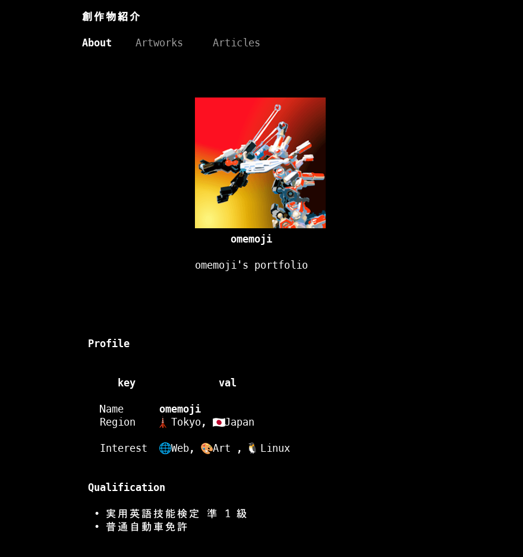

## はじめに

ターミナル上で（テキストベースの）web ブラウザを動かす試みは、何も近年始まったことではない。
最も有名な例としては、東北大学の伊藤彰則教授によって開発された [w3m](https://w3m.sourceforge.net/index.ja.html) が挙げられるだろう（現在は Debian のリポジトリ内で開発が継続されている）。
また、それ以外にも[Lynx](https://lynx.invisible-island.net/)や[Browsh](https://www.brow.sh/)などの実装がある。

しかし、これらのブラウザは宿命的にある特徴を持っていた ── 基本的に CSS が効かない[^browsh]。
「構造化文書が読めればそれでいい」という人にとっては問題ないかもしれないが、現代のブラウザとしては CSS に対応していないのは辛い。
そう思っていたある日、[Hacker News で話題となっていたサイト](https://news.ycombinator.com/item?id=44293260)が目に入った。
そこで紹介されていたブラウザが、本記事で紹介する Chawan である。

[^browsh]: Browsh は HTML5 や CSS3 に対応しているが、これは ヘッドレスモードで起動した firefox をバックエンドとしているからである

## Chawan: TUI web browser



https://chawan.net/

Chawan は Unix 系のシステム[^unix]で動作するテキストベースの web ブラウザであり、Nim で実装されている。
基本的な使い方としては、

```sh
cha google.com
```

でリンク先を閲覧することが出来る。

を開いた結果。違いは一目瞭然である](./difference.png)

Chawan のメリットとしては、

- 基本的な CSS に対応している
- （DOM 操作や API を叩くなどの）JavaScript に対応している
- sixel を用いて画像表示が出来る[^imagePreview]

などがある。テキストベースの web ブラウザとしては、頭一つ抜けてモダンな機能が実装されている。

[^unix]: Linux, macOS や FreeBSD など
[^imagePreview]: これは w3m でも出来る

## インストール

### バイナリを入手する

| Package  | Link                                          |
| -------- | --------------------------------------------- |
| AUR      | https://aur.archlinux.org/packages/chawan-git |
| NixOS    | https://search.nixos.org/packages?show=chawan |
| AppImage | https://git.lerch.org/lobo/chawan-appimage/   |

一部のパッケージマネージャには既に登録されている。また、AppImage ファイルを直接ダウンロードすることも可能である。

### ビルドする

[https://sr.ht/~bptato/chawan/#compiling](https://sr.ht/~bptato/chawan/#compiling)を参考にビルドしていく。

1. Chawan のリポジトリをクローンする

```sh
git clone https://git.sr.ht/~bptato/chawan && cd chawan

```

2. Nim コンパイラをインストールする
3. 依存関係をインストールする
   - OpenSSL
   - libssh2
   - brotli
   - pkg-config
   - GNU make
4. `make`を実行する
5. `sudo make install`を実行する

## 各種設定

### 画像表示

Chawan では、画像表示プロトコルとして Sixel または Kitty を用いている。
そのため、画像を表示したい場合はこれらをサポートしているターミナルを使う必要がある。
なお、筆者のおすすめは Wezterm である（Sixel をサポートしている）。

https://wezterm.org/index.html

### 設定ファイル（参考）

`config.toml`の設定は以下。

```toml title="config.toml"
include = "w3m.toml"
[buffer]
images = true

```

また、`w3m.toml`（キーバインディングを w3m のものに近づける設定）は以下。

https://github.com/omemoji/dotfiles/blob/main/config/chawan/w3m.toml

## おわりに

w3m に代わる新たな TUI ブラウザとして期待が持てるが、欲を言えば

- より広範な CSS 対応（grid や object-fit など）
- より多くのパッケージマネージャへの採用（e.g. apt, xbps, homebrew）

などが実現されるとさらに嬉しい。
