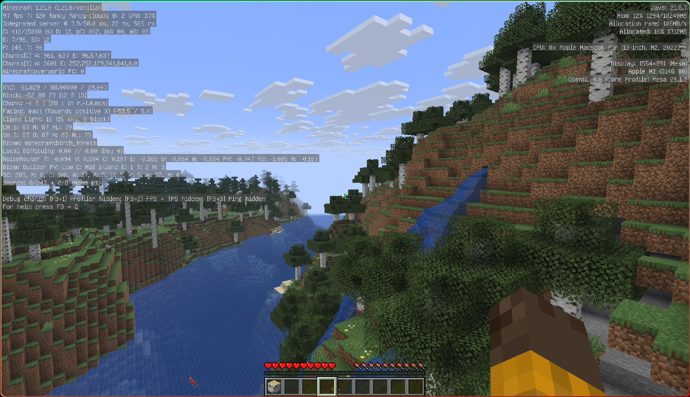
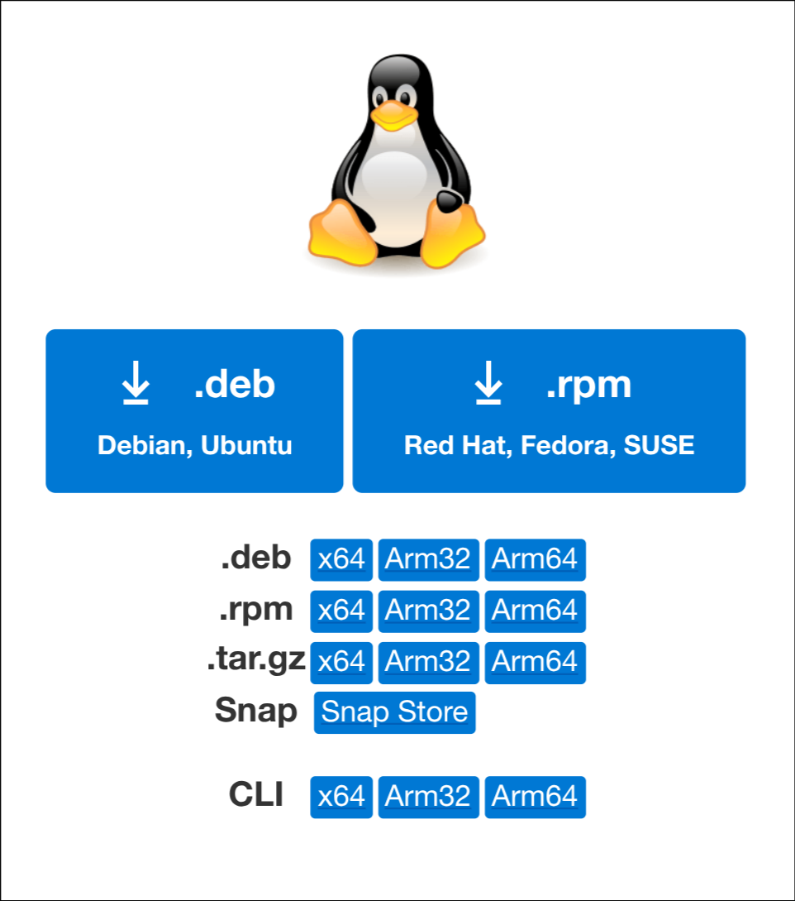

## はじめに

https://x.com/omemoji_art/status/1955116274100605103

MacBook Air (M2, 2022) に arm64 アーキテクチャの Void Linux をインストールすることに成功した。本記事ではインストールの方法、および実際に使ってみた感想や Tips などについて記す。なお、この記事は Linux にある程度慣れている人向けであり、初めて Linux に触れる人には**全く**おすすめできない。

Void Linux 自体に関しては、以下の記事を参照のこと。

https://omemoji.com/articles/void_linux

### 背景

https://support.apple.com/ja-jp/111867

筆者は最近、普段使い用の PC を新調した。ビックカメラの店頭にて新古品の MacBook Air(M2, 2022)が 12 万円で売られていたので、それをメインマシンとすることにしたのである。3 年前に買って愛用していた ThinkPad は 3, 4 時間で電池切れする上に重くて持ち運び辛かったので、軽くてバッテリーが保つラップトップを求めた結果自然と MacBook Air に行き着いた。

Apple Silicon を搭載した MacBook Air は持ち運びに適した軽さとバッテリー持ちの良さ、そしてそれにも関わらず高いパフォーマンス...と、ラップトップとしての総合的な完成度の高さが魅力になっている。そして何より、 **Linux をインストール出来る**。なんでも **[Asahi Linux](https://asahilinux.org)** なるプロジェクトによって、M1/M2 に関しては GPU を始めとしたかなりの部分まで Linux が動くようになったのだという。

ThinkPad に Linux を入れて普段使いしていた筆者にとって、Asahi Linux の存在は朗報だった ── ノート PC に必要な全てを備えた、どこにでも持っていける最高の Linux ラップトップ。そのロマンに突き動かされ、気づくとターミナルを叩いて Asahi Linux のインストールを開始していたのであった。~~最悪 macOS 使えばいいし~~

## Asahi Linux って何？

https://asahilinux.org/

Asahi Linux は、Linux を Apple Silicon 搭載の Mac に移植することを目指すプロジェクトである。M1/M2 チップが主にサポートされている。

プロジェクトは継続的かつ情熱をもって進められており、数ヶ月おきにブログで進捗が公開されている。また、Asahi Linux を開発していく中で、 「OpenGL / Vulkan 対応の GPU ドライバをリバースエンジニアリングで開発する」「上流の Linux カーネルにコードを上げる」などの成果を挙げている。ブログの日本語訳（非公式）は以下を参照。

https://qiita.com/asfdrwe/items/6f550bf200a39911c29e

### Void の Asahi 対応

https://docs.voidlinux.org/installation/guides/arm-devices/apple-silicon.html

Asahi Linux プロジェクトが公式にサポートしているディストロとしては [Fedora Asahi Remix](https://asahilinux.org/fedora/) があるが、それ以外にも Asahi Linux に対応したディストロが有志により開発されている。筆者が普段使いしている Void Linux も、[Apple Silicon を始めとした arm64 デバイス への対応が着々と進んでいる](https://voidlinux.org/news/2025/02/new-images.html)ようだ[^multi_architecture]。そこで本記事では、Asahi Linux に対応した arm64 版の Void Linux をインストールすることにする。

[^multi_architecture]: Void Linux はもともと arm64 版を公式にサポートしており、設計思想からして幅広いデバイスでの使用を想定していることが伺える。ちなみに Rasberry Pi にもインストール出来る

## インストール

### Asahi Linux のインストール

```sh
curl https://alx.sh | sh
```

を実行するだけで、 Asahi Linux のインストールスクリプトが走る。

https://note.com/yu_ri_sys/n/n778e42806ff8

全体的な流れは上記に詳しい。
基本的にはターミナルの指示に従っていれば問題ないが、以下の表示が出たら必ず 5 を選択すること[^why5]。

```sh
Choose an OS to install:
  1. Fedora Asahi Remix 42 with KDE Plasma
  2. Fedora Asahi Remix 42 with GNOME
  3. Fedora Asahi Remix 42 Server
  4: Fedora Asahi Remix 42 Minimal
  5: UEFI environment only (m1n1 + U-Boot + ESP)
  OS:
```

[^why5]: 後ほどディスクの free space に Void Linux をインストールするため

### Void Linux のインストール

上記の行程でインストールしたのは Apple Silicon で Linux を動かすための UEFI 環境のみであり、Void Linux 自体は自分でインストールしなければならない。よって、その手順を以下に示す。

https://docs.voidlinux.org/installation/guides/chroot.html

基本的には上記リンクに従ってインストールを進めるが、Asahi Linux 特有の点を考慮してこちらにも具体的なステップを書いている。

#### ブータブル USB

https://voidlinux.org/download/

まずは、インストーラを起動するために ブータブル USB を用意する。公式サイトのダウンロードページから`arm platforms > apple silicon (asahi)`の live image をダウンロードし、`dd`コマンドなどを使って USB に焼く。そして起動時に先程インストールした UEFI ブートローダ（Asahi Linux のロゴのやつ）を選択すると、USB から Void Linux のインストーラが立ち上がる。

なお、以降の手順は base イメージを選択した場合のものである。base イメージを選択した場合、全ての操作は CUI で行うことになる。

#### ファイルシステム

まず、`fdisk`で Linux ファイルシステム用のパーティションを 1 つ作成する。free space にパーティションを作った後、

```sh
mkfs.ext4 /dev/nvme0n1p5 # /dev/nvme0n1p5 にファイルシステムが出来た場合
```

でパーティションをフォーマットする。 このとき、EFI System Partition は Asahi Linux のインストール時に生成されたものを使う（自分で作成する必要はない）。

その後、Filesystem と EFI System Partition をマウントする。

```sh
# ルートファイルシステムのマウント
mount /dev/nvme0n1p5 /mnt/
# EFI システムパーティションのマウント
mkdir -p /mnt/boot/efi/
mount /dev/nvme0n1p4 /mnt/boot/efi/
```

#### ベースシステムのインストール

続いて、ベースシステムをインストールする。
まず、パッケージのインストール時に使う RSA キーをターゲットのルートディレクトリにコピーする。

```sh
mkdir -p /mnt/var/db/xbps/keys
cp /var/db/xbps/keys/* /mnt/var/db/xbps/keys/
```

その後、基礎的なシステム用のパッケージをインストールする。`base-system`, `asahi-base`, `asahi-scripts`の 3 つを必ずインストールすること。

```sh
XBPS_ARCH=aarch64 xbps-install -S -r /mnt -R "https://repo-default.voidlinux.org/current/aarch64" base-system asahi-base asahi-scripts
```

#### 各種設定

マウントしたファイルシステムに基づき、fstab を生成する。

```sh
xgenfstab -U /mnt > /mnt/etc/fstab
```

`xchroot`を使ってファイルシステム内部に入る。

```sh
xchroot /mnt /bin/bash
```

好きなホスト名を指定する。また、`/etc/rc.local`や`/etc/default/libc-locales`なども編集する。

```sh
echo void-asahi > /etc/hostname # ホスト名を指定する
vi /etc/rc.conf # キーボード配列やローカルの時刻を設定する
# localeを生成する
vi /etc/default/libc-locales # 適用したいlocaleをコメントアウトする
xbps-reconfigure -f glibc-locales
# ローカルの時刻を設定する
ln -sv /usr/share/zoneinfo/<Timezone> /etc/localtime

```

#### ブートローダ

ブートローダとしては、GRUB をインストールする。

```sh
xbps-install -S grub-arm64-efi
grub-install --target-arm64-efi --efi-directory=/boot/efi --bootloader-id="Void" --removable
```

#### 最終確認

インストールした全てのパッケージが適切に設定されていることを確認する。

```sh
xbps-reconfigure -fa
```

インストールが終了したので、ファイルシステムをアンマウントして電源を切る。

```sh
exit # chrootから抜ける
umount -R /mnt # ファイルシステムをアンマウントする
shutdown -r now # 電源を切る
```

インストールが成功していれば、GRUB が立ち上がり Void Linux を起動出来るようになっているはずである。あとは好きにカスタマイズしてしまおう。


## 実際に使ってみて

全体的に、思ったよりも快適に使うことが出来た。ただし、普段使いするには辛い部分もまた多い。

### 👍 メリット

#### 高品質な Linux ラップトップ



パフォーマンスとバッテリーに関しては、一般的なノート PC を大きく上回っている。例えばブラウザの閲覧、コーディングからイラスト制作に至るまで、一切カクつくことなくスムーズに作業することが出来る。また、それらの作業であれば 8 時間くらいはバッテリーが持つ（これは Linux のラップトップとしては破格である）。Apple Silicon 最大の特徴である GPU の性能も存分に引き出されており、Minecraft のバニラであれば概ね 80~100fps くらい出る[^minecraft]。

[^minecraft]: リバースエンジニアリングにより生まれたネイティブな OpenGL ドライバを採用しているためか、minecraft に関しては macOS と遜色ない、あるいは少し高いパフォーマンスが出るようだ

また、ハードウェアが持つルックアンドフィールの良さも見逃せない。Apple のこだわりが光るアルミ削り出しの筐体もさることながら、高解像度で鮮やかな発色の Retina ディスプレイは「Linux はこんなに美しかったのか」という新しい発見をさせてくれることだろう。トラックパッドの操作感も損なわれておらず、マウスやキーボードを持ち出し辛い出先での作業においても全く支障をきたすことはない。概して Linux ラップトップとしては性能、携帯性の両面において非常に完成度が高い。

#### トラブルシューティングのしやすさ

「特殊な環境の上使用者が少ないから、トラブルシューティングはしづらいのではないか」と思った人がいるかもしれないが、実はその逆である。

そもそも PC のトラブルシューティングにおける困難のうち少なくない部分は、「ハードウェアが多様なのでトラブルが生じた環境を再現・切り分けしづらい」という事実に由来する。一方 Asahi Linux を見ると、対応するデバイスは当然ながら M1 以降の Mac に限定されているし、各デバイスへの対応状況も事細かに記録されている。つまり、「ユーザーが原因の問題」と「Asahi Linux 側の（現状ではどうしようもない）問題」を切り分けることが非常に容易なのだ。もっとも、トラブルシューティングがしやすいだけで「トラブルが少ない」わけではないのだが。

### 👎 デメリット

上では褒めちぎったものの、デメリットも決して無視できるほど小さいわけではない。Asahi Linux を使うかどうかは、想定するユースケースに合うかどうかをよく考えてから決めるべきである。

#### 発展途上

Asahi Linux は発展途上のプロジェクトであるため、一部の（時に重要な）機能がうまく動作しない。例えば、現状では

- USB-C ポートから映像出力が出来ない
- サスペンド時の電力消費が多い（1 時間に 2％くらい）
- ハードウェアでのビデオエンコード / デコードがサポートされておらず、YouTube を視聴するだけで十数%ほど CPU を使ってしまう

といった問題点がある。これらを許容出来ない人はまだ使わない方がいいだろう。

#### 対応アプリの少なさ

アーキテクチャが arm64 であることに由来する、アプリのインストール関連の問題がある（x86_64 版のビルドしか用意されていないなど）。OSS を始めとしたソースコードが公開されているものについては自前でビルドすれば良いが、プロプライエタリなものだとインストールに工夫、あるいは妥協が必要となる場合がある。

### ⚖ macOS との比較

MacBook 本来の OS である macOS とも比較してみよう。まず、メモリ消費量の少なさでは確実にこちらが勝っている。macOS では起動するだけで 6~7GB ものメモリを消費するが、Asahi Linux の場合はブラウザのタブをありったけ開きながら開発環境を立ち上げてコーディングしても その値を超えることはめったにない（筆者はウィンドウマネージャとして Hyprland を使っている）。それ以外にも、(Asahi) Linux が持つデスクトップ環境の自由度は macOS には全く真似できない部分だろう[^freedom]。たとえ KDE Plasma の見た目が嫌いでも、今度は（例えば）Gnome をインストールしてみればよいのである。
[^freedom]:カスタマイズ性の低さは必ずしもデメリットとは限らない、という視点もある

一方、全体的なパフォーマンスは Linux を搭載したラップトップとしては優れているものの、流石に macOS と比べると（特に電源管理において）最適化が進んでいない。例えば、半日ほどスリープ状態にしただけで充電が 25%ほど減ってしまう。また、当然ながら使えるアプリも macOS の方が充実している傾向にある。結論として、高い自由度を求める人以外は macOS の方が使いやすいのかもしれない。

## Tips

ここでは、Asahi Linux を普段使いする上で有用かもしれない tips を提供する。

### Google Chrome

前提として、Linux 向けの Google Chrome は arm64 版のビルドが存在しない。つまり、arm64 アーキテクチャである M1/M2 チップ上で動作する Asahi Linux は、Google Chrome を使えない ── ように見える。

しかしよく考えてみてほしい。Google Chrome を使うメリットは「Google アカウントを介してパスワードやブックマークを同期出来ること」それに尽きるのではないだろうか？
であれば、Chromium を Google アカウントと同期させれば殆ど同じことが出来るはずである。幸いにも Chromium は普通にインストール出来るので、今回は Chromium をカスタマイズする方針をとる。

```sh
sudo xbps-install -S chromium
```

Chromium をインストールしたあと、 Google Sync API を取得する。具体的な手順は以下の記事に従えばよい。

https://658c196ef6.seesaa.net/article/474071017.html

そして`chromium`の起動時にそれらの環境変数をオプションとして追加すれば、Google アカウントとの同期が出来るようになる。自分でデスクトップエントリー（`~/.local/share/applications/chromium.desktop`）を作ると楽である。

### Visual Studio Code

x86_64 版の xbps リポジトリ には`vscode`パッケージが存在する（実際には OSS 版の Code-OSS がインストールされる）が、arm64 版のリポジトリにはそれがない。そのため、VSCode の公式サイトから直接 arm64 版の Linux 向け tar.gz をダウンロードする（deb パッケージ をダウンロードした後 [xdeb](https://github.com/xdeb-org/xdeb) を使ってもよい）。

https://code.visualstudio.com/download



### Discord

Discord には ARM Linux 版のビルドが存在せず、プロプライエタリである以上自分でソースコードをビルドするわけにもいかない。また、Web 版を使おうとするとやたらと CPU に負荷がかかる（Discord だけで 20~30%くらい消費する）。

https://www.reddit.com/r/AsahiLinux/comments/zxk8ap/comment/j23cl4p/?utm_source=share&utm_medium=mweb3x&utm_name=mweb3xcss&utm_term=1

一応 Arch Linux で arm64 版 Discord ビルドに成功した事例が存在するようなので、それを参考にして Void Linux でもインストールに挑戦してみたい。

## おわりに

円安が進む中で大枚はたいて買った MacBook を改造するのは勇気がいるかもしれないが、Linux に興味がある、あるいは macOS に飽きたり嫌気が差してしまった人は是非 Asahi Linux をインストールしてみよう。
