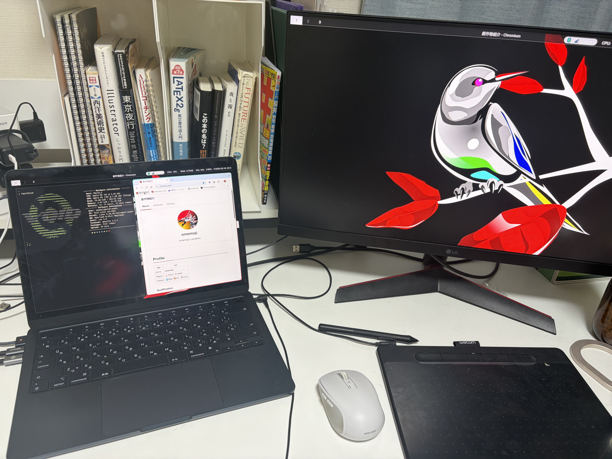

## はじめに

ARM64版のVoid Linuxを搭載したMacBook Air M2で、USB Type-Cから外部ディスプレイへの接続に成功した。
本記事では、それを可能にするハックが施されたAsahi LinuxカーネルをVoid Linuxでビルド、およびインストールする方法を記す。

### 背景

普段使い用のMacBook AirにAsahi Linux（ディストロはVoid Linux）を入れてから約半年が経過した。
軽くて（Linuxラップトップにしては）バッテリーが持ち、しかもMinecraftを快適にプレイ出来るこの素晴らしい道具は、しかし「ディスプレイをつなぐことが出来ない」という重大な欠点を抱えていた。故に、Asahi Linuxを使う者はコードを書きながらブラウザで動作確認することも、ゲームをやりながらゲーム実況を見ることも出来ない生活を受け入れる必要があった。

https://asahilinux.org/2026/02/progress-report-6-19/

この「DP Alt Mode[^dp-alt]」問題はAsahi Linuxコミュニティでも特に注目されており、Asahi Linuxの開発チームには

> _“When will display out via USB-C be supported?”_\
> _“Is there an ETA for DisplayPort Alt Mode?”_\
> _“Can I use an HDMI adapter on my MacBook Air yet?”_

という旨の質問がIRCやMatrixで週に一度は飛んできたという。
そうした質問攻めはいくら丁寧にお願いしてもやむ気配がなく、結局

> DP Alt Mode will be done when it’s done.

と答えるしかなかったようだ。

[^dp-alt]: USB Type-CからDisplayPort/HDMIで直接映像を出力する機能のこと

https://github.com/AsahiLinux/linux/tree/fairydust

しかし、彼らは**成し遂げた**。なんと現在、Asahi Linuxカーネルの`fairydust`ブランチにてDP Altモードでの映像出力を可能にするハックが実装されている。
（いくつかのバグはまだ残っているが）この偉大な達成を目にした筆者は、マイクラ実況を見ながらマイクラをする生活を求めてLinuxカーネルのビルドに臨むのだった。

## ハック済みLinuxカーネルをインストールする

https://elsainmac.tistory.com/1017

実は、Fedora Asahi Remixでは既に成功例が存在している（詳細は上記を参照）。
これを参考に、Void Linuxで`fairydust`ブランチのLinuxカーネルをビルドしてインストールする方法を紹介する。なお、Fedora Asahi Remixを使っている人は上記記事を直接見ることをおすすめする。

### void-packagesの導入

まず、[void-packages](https://github.com/void-linux/void-packages)をGitHubからcloneする。void-packagesは、xbps[^xbps]形式のバイナリパッケージをビルドするために必要な様々なスクリプト、およびツール類をまとめたビルドシステムである。パッケージをビルドするためのライブラリを作業ディレクトリ内に隔離した状態でインストール出来るため、システム全体を汚さずに済む。
本記事では、これを用いてAsahi Linuxのカーネルをビルドする。

[^xbps]: Void Linuxのパッケージマネージャー

```sh
git clone https://github.com/void-linux/void-packages
cd void-packages
```

でリポジトリに入る。

また、`xtools`もインストールしておこう。xtoolsは、xbpsで使える便利なコマンドを取り揃えたユーティリティである。

```sh
sudo xbps-install -S xtools
```

### 設定ファイルの編集

`srcpkgs/linux-asahi`配下の2ファイルを、以下のように書き換える。

#### 1. `srcpkgs/linux-asahi/template`

```diff title=template
 diff --git a/srcpkgs/linux-asahi/template b/srcpkgs/linux-asahi/template
 index 1e3c5500167..3becf94084d 100644
 --- a/srcpkgs/linux-asahi/template
 +++ b/srcpkgs/linux-asahi/template
@@ -1,12 +1,15 @@
# Template file for 'linux-asahi'
pkgname=linux-asahi
-version=6.18.9+1
+version=6.18.10+fairydust
revision=1
+
+_commit=61b6e714dd19b7bee1c0e6ec4234199e640c2932
+
short_desc="Linux kernel and modules for Apple Silicon"
maintainer="dkwo <npiazza@disroot.org>, Will Springer <skirmisher@protonmail.com>"
license="GPL-2.0-only"
homepage="https://asahilinux.org"
-distfiles="https://github.com/AsahiLinux/linux/archive/asahi-${version/+/-}.tar.gz"
+distfiles="https://github.com/AsahiLinux/linux/archive/${_commit}.tar.gz>${pkgname}-${version}.tar.gz"
checksum=36ba3a3e4c5308d4e3c9c91aba98f727fc03ee5cd015cb8ffb522fa4e7265425
+wrksrc="linux-${_commit}"

python_version=3
```

以上のように変更を加えた後、

```sh
./xbps-src -i linux-asahi
```

でファイルの整合性を検証する。

#### 2. `srcpkgs/linux-asahi/files/arm64-dotconfig`

```diff title=arm64-dotconfig
 diff --git a/srcpkgs/linux-asahi/files/arm64-dotconfig b/srcpkgs/linux-asahi/files/arm64-dotconfig
 index 74134f02df0..06bdf7e2974 100755
 --- a/srcpkgs/linux-asahi/files/arm64-dotconfig
 +++ b/srcpkgs/linux-asahi/files/arm64-dotconfig
@@ -2382,7 +2382,7 @@ CONFIG_NVME_VERBOSE_ERRORS=y
# CONFIG_NVME_FC is not set
# CONFIG_NVME_TCP is not set
# CONFIG_NVME_HOST_AUTH is not set
-CONFIG_NVME_APPLE=m
+CONFIG_NVME_APPLE=y
# CONFIG_NVME_TARGET is not set
# end of NVME Support

@@ -5831,7 +5831,7 @@ CONFIG_USB_HIDDEV=y
#
# SPI HID support
#
-CONFIG_SPI_HID_APPLE_OF=m
+CONFIG_SPI_HID_APPLE_OF=y
# end of SPI HID support

CONFIG_SPI_HID_APPLE_CORE=m
@@ -6738,7 +6738,7 @@ CONFIG_APPLE_PMGR_MISC=y
CONFIG_APPLE_TUNABLE=m
CONFIG_APPLE_RTKIT=y
CONFIG_APPLE_RTKIT_HELPER=m
-CONFIG_APPLE_SART=m
+CONFIG_APPLE_SART=y
CONFIG_RUST_APPLE_MAILBOX=y
CONFIG_RUST_APPLE_RTKIT=y
CONFIG_APPLE_AOP=m
```

それぞれ、モジュールとしてではなくカーネル内に組み込むようにすると安定性が増すらしい。

### ビルド

```sh
./xbps-src pkg linux-asahi
```

を実行し、ビルドする。カーネルモジュールを大量に入れるためか、ビルドが終わるまでに約20分もかかった。
気長に待とう。

### インストール

```sh
xi linux-asahi
```

でビルドしたLinuxカーネルパッケージをインストールする。

### 成功！

その後再起動してfairydustと記されたカーネルを選択すれば、（うまくいけば）外部モニターに画面が映るはずである。
ただし、USB Type-C ポートは**本体左側にある2つのうち前方**のものを使う必要がある。

カスタムされたLinuxカーネルを自分でビルドするのは一見ハードルが高く見えるが、void-packagesのおかげで意外と簡単に出来る。（世界に何人いるのか知らないが）Void LinuxをMacBookに入れている人、また本記事を読んで入れたくなった人は是非参考にしてほしい。

## おわりに

> _プロプライエタリなAppleのハードウェアに正面から立ち向かい、リバースエンジニアリングを続けてきた世界中のOSS開発者の皆へ_

ありがとう。
