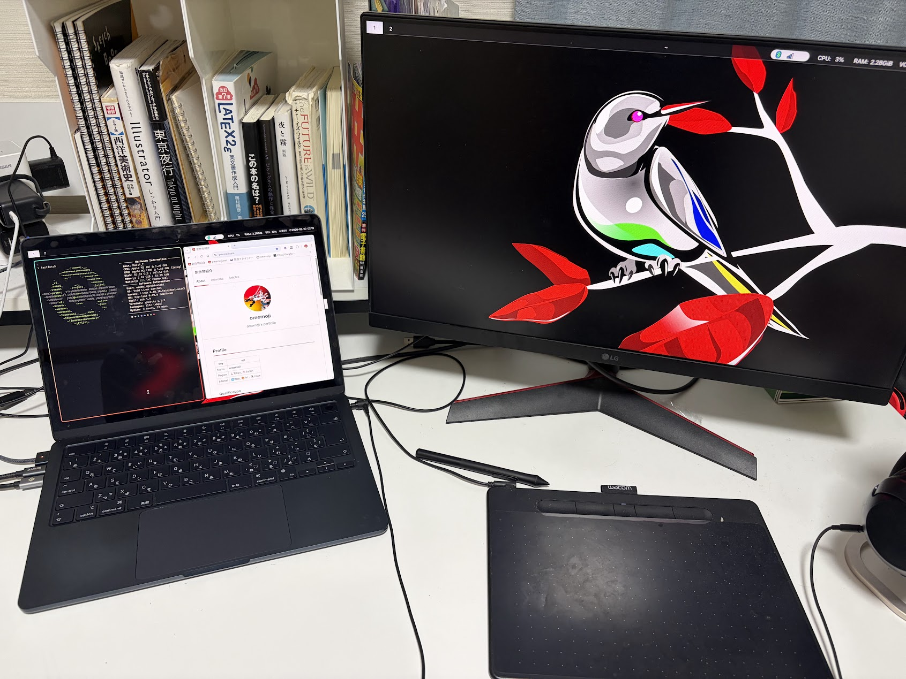

## はじめに



ARM64版のVoid Linuxを搭載したMacBook Air M2で、USB Type-Cから外部ディスプレイへの接続に成功した。
本記事では、それを可能にするハックが施されたAsahi LinuxカーネルをVoid Linuxでビルド、およびインストールする方法を記す。

### 背景

普段使い用のMacBook AirにAsahi Linux（ディストロはVoid Linux）を入れてから約半年が経過した。
軽くて（Linuxラップトップにしては）バッテリーが持ち、しかもMinecraftを快適にプレイ出来るこの素晴らしい道具は、しかし「ディスプレイをつなぐことが出来ない」という重大な欠点を抱えていた。故に、Asahi Linuxを使う者はコードを書きながらブラウザで動作確認することも、ゲームをやりながらゲーム実況を見ることも出来ない生活を受け入れる必要があった。

https://asahilinux.org/2026/02/progress-report-6-19/

この「DP Alt Mode[^dp-alt]」問題はAsahi Linuxコミュニティでも特に注目されており、Asahi Linuxの開発チームには

> _“When will display out via USB-C be supported?”_\
> _“Is there an ETA for DisplayPort Alt Mode?”_\
> _“Can I use an HDMI adapter on my MacBook Air yet?”_

という旨の質問がIRCやMatrixで週に一度は飛んできたという。
そうした質問攻めはいくら丁寧にお願いしてもやむ気配がなく、結局

> DP Alt Mode will be done when it’s done.

と答えるしかなかったようだ。

[^dp-alt]: USB Type-CからDisplayPort/HDMIで直接映像を出力する機能のこと

https://github.com/AsahiLinux/linux/tree/fairydust

しかし、彼らは**成し遂げた**。なんと現在、Asahi Linuxカーネルの`fairydust`ブランチにてDP Altモードでの映像出力を可能にするハックが実装されている。
（いくつかのバグはまだ残っているが）この偉大な達成を目にした筆者は、マイクラ実況を見ながらマイクラをする生活を求めてLinuxカーネルのビルドに臨むのだった。

## ハック済みLinuxカーネルをインストールする

2026-07-09追記: [カスタムパッケージを配布するxbpsリポジトリ](https://github.com/omemoji/void-asahi-fairydust)を作成したので、全面的に修正した。

https://elsainmac.tistory.com/1017

実は、Fedora Asahi Remixでは既に成功例が存在している（詳細は上記を参照）。
これを参考に、Void Linuxで`fairydust`ブランチのLinuxカーネルをインストールする方法を2つ紹介する。なお、Fedora Asahi Remixを使っている人は上記記事を直接見ることをおすすめする。

### 1. カスタムxbpsリポジトリを導入する

https://github.com/omemoji/void-asahi-fairydust

`linux-asahi-fairydust`パッケージをインストール出来るカスタムxbpsリポジトリを作成したので、それを導入するのが最も早いだろう（公式リポジトリではないため、使用は自己責任）。

#### 手順

1. リポジトリを追加する。`/etc/xbps.d/10-void-asahi-fairydust.conf`を追加し、以下のように書く。

   ```txt title=/etc/xbps.d/10-void-asahi-fairydust.conf
   repository=https://raw.githubusercontent.com/omemoji/void-asahi-fairydust/repository-aarch64
   ```

2. リポジトリを更新し、以下のコマンドでインストールする。

   ```sh
   sudo xbps-install -S
   sudo xbps-install linux-asahi-fairydust
   ```

   インストールが完了したら再起動する。

### 2. 自分でビルドする

自分でパッケージをビルドする場合、上記カスタムリポジトリに加え[void-packages](https://github.com/void-linux/void-packages)リポジトリもクローンする必要がある。

クローン後、以下の手順で`linux-asahi-fairydust`パッケージを自作する。

```sh
cp -r srcpkg/linux-asahi-fairydust <void-packages>/srcpkgs/
cd <void-packages>
./xbps-src pkg linux-asahi-fairydust
```

### インストール後

再起動してfairydustと記されたカーネルを選択すれば、（うまくいけば）外部モニターに画面が映るはずである。
ただし、USB Type-C ポートは**本体左側にある2つのうち前方**のものを使う必要がある。

カスタムされたLinuxカーネルを導入するのは一見ハードルが高く見えるが、void-packagesのおかげで意外と簡単に出来る。（世界に何人いるのか知らないが）Void LinuxをMacBookに入れている人、また本記事を読んで入れたくなった人は是非参考にしてほしい。

## おわりに

> _プロプライエタリなAppleのハードウェアに正面から立ち向かい、リバースエンジニアリングを続けてきた世界中のOSS開発者の皆へ_

ありがとう。
