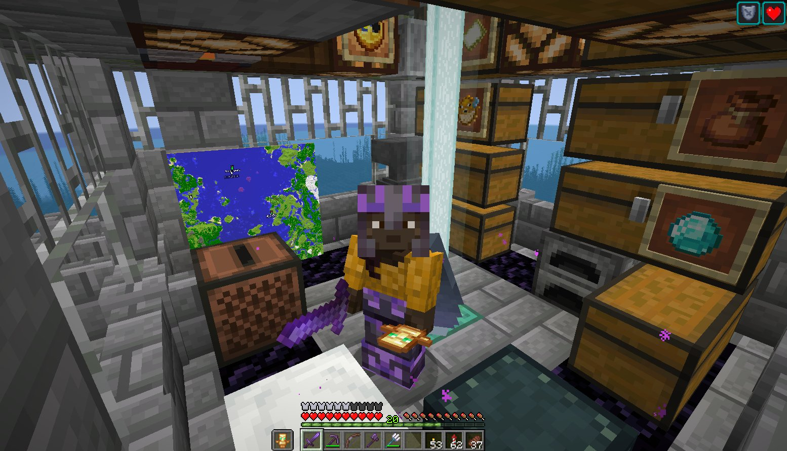
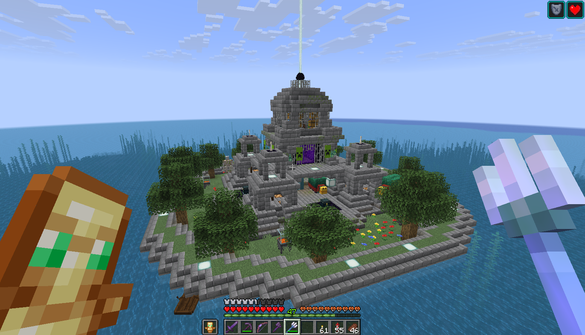

## はじめに

Asahi Linux [^void] でMinecraftをプレイし始めて数カ月が経った。
本記事ではLinuxでMinecraftを遊ぶ方法、および筆者がマイクラを500時間ほどやりこんだ成果を記す。

[^void]: ディストロはVoid Linux

## 遊び方

### PCのスペック

## マイクラ日記

### 拠点

### 装備

### コレクション

#### レコード

#### 鍛冶型

## おわりに

Minecraftに一度ハマると数百時間は余裕で遊べてしまうため、勉強や仕事に忙しいときは特に注意した方が良い。
