## はじめに

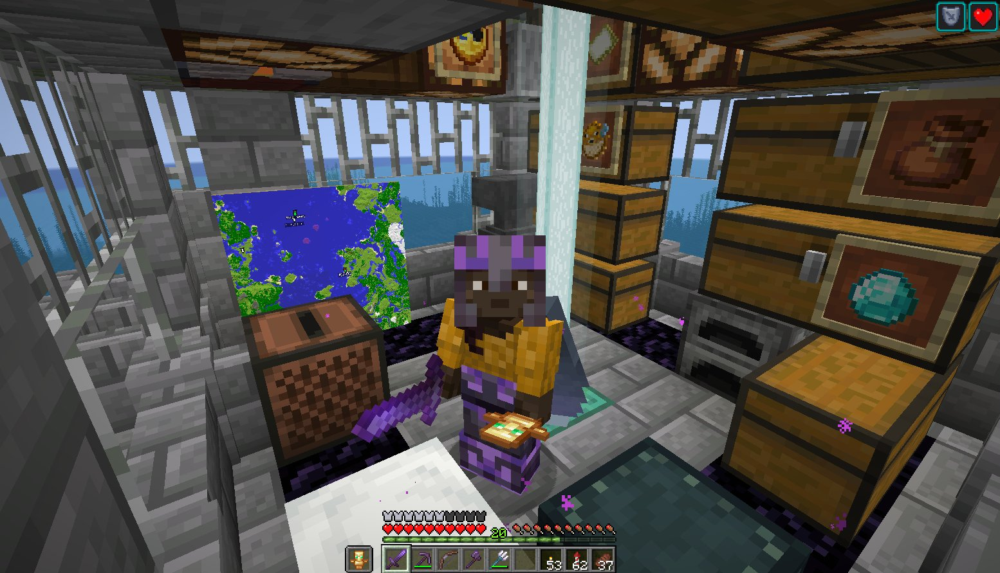

筆者は最近、Void LinuxをインストールしたMacBook AirでMinecraftを楽しんでいる。
本記事ではLinuxでMinecraftをプレイする方法、および筆者によるMinecraftのプレイ記録等を記す。

## LinuxでMinecraftをプレイする方法

ここでは、バニラ（MODを入れていないデフォルトの状態）のJava版MinecraftをLinuxで遊ぶ手順を記す。
そこまで難しくはない上にネット上にたくさん情報が転がっているため、簡潔な説明にとどめる。なお、Minecraftの購入自体は既に済ませているものとする。

### 💻️推奨スペック

https://www.minecraft.net/ja-jp/store/minecraft-java-bedrock-edition-pc?tabs=%7B%22details%22%3A1%7D

以上の公式サイトから、必須/推奨スペック表の一部を引用する。

| 項目               | 最低                                                                                 | 推奨                                                                                                   |
| :----------------- | :----------------------------------------------------------------------------------- | :----------------------------------------------------------------------------------------------------- |
| **OS**             | Windows 7 以上、または macOS 10.14.5 Mojave 以上。                                   | Windows 10 以上、または macOS 10.14.5 Mojave 以上。                                                    |
| **アーキテクチャ** | ARM、x64、x86                                                                        | ARM、x64、x86                                                                                          |
| **メモリ**         | 2 GB                                                                                 | 4 GB                                                                                                   |
| **プロセッサー**   | Intel Core i3-3210 3.2 GHz \| AMD A8-7600 APU 3.1 GHz \| Apple M1 もしくはこれと同等 | Intel Core i5-4690 3.5 GHz \| AMD A10-7800 APU 3.5 GHz \| Apple M1 もしくはこれと同等                  |
| **グラフィック**   | Intel HD Graphics 4000 \| AMD Radeon R5                                              | OpenGL 4.45 対応 NVIDIA GeForce 700 シリーズまたは AMD Radeon Rx 200 シリーズ (統合チップセットを除く) |

要求スペックだけで言えば全く高くはなく、現在使われているPCであれば容易に満たせると思われる。
ただしMODを入れたり同時にブラウザなどを開いたりする場合も考えると、エントリークラスのゲーミングPC程度の性能があると安心だろう。

筆者はゲーミングPCを持っていないので、MacBook Air M2にAsahi Linuxを入れてMinecraftを動かしている。
Apple Siliconの優れたGPU性能と最新のOpenGLによって、80~100fpsという（ラップトップとしては）破格のパフォーマンスが出る。

### 🚀Prism Launcherのインストール

https://prismlauncher.org/download/linux/

ランチャー（Minecraftを起動するためのソフトウェア）は公式のものではなく、「Prism Launcher」というカスタムランチャーをインストールする。
インストール方法は上記リンクを参照。

公式のランチャーと比較すると様々な面で優れており、

- 大体のLinuxディストリビューションでインストール出来る
- Minecraft・JavaのバージョンやMODの管理が楽

などのメリットがある。

### ⚙️インストール後の設定

Prism Launcherの最初の起動時には、言語設定とJavaのバージョン選択を行う。
なお、Javaは事前にインストールしておく必要がある。適切なJavaのバージョンはMinecraftのバージョンごとに決まっているが、新しいバージョンであればJava21、古い場合はJava8をインストールしておけば大体動くはずである。

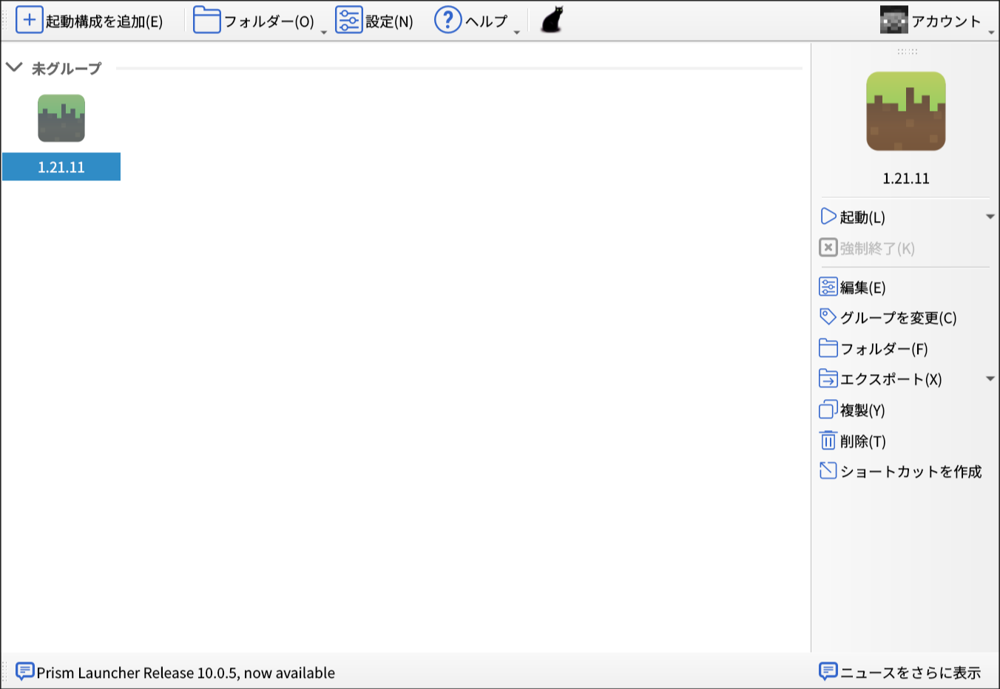

上記設定が終わったら、Microsoftアカウントへのログインを行う。画面右上から`アカウント -> アカウントの管理 -> Minecraftアカウントを追加`とクリックしていき、指示に従ってMicrosoftアカウントを登録する。

### 🔛起動構成の追加

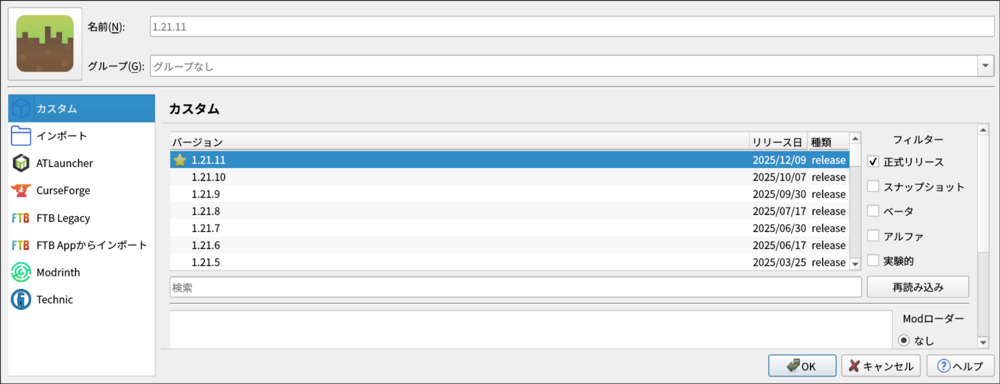

最後に、Minecraftを起動するための構成を追加する。
プレイしたいバージョンを選択して「OK」ボタンを押せば、Minecraftを遊べるLinuxマシンの完成である。

### 🛠️MODの導入

本記事では詳しく解説しないが、MODを入れたい場合は以下の記事を参照。

https://komnazsk.hatenablog.jp/entry/2023/04/23/140728

## プレイ記録

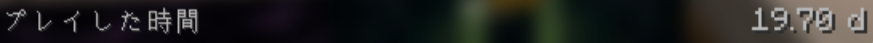

ここからは、筆者によるMinecraftのプレイ内容について紹介する。
なお、ワールドのシード値は`-3411276577514605418`である。

### 🏯拠点

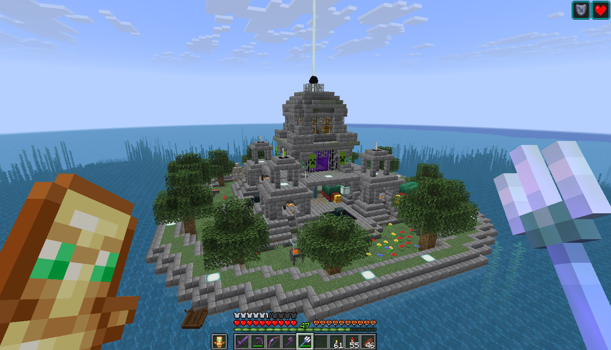

現在メインで使っている拠点、およびその周辺について記す。

#### 立地について

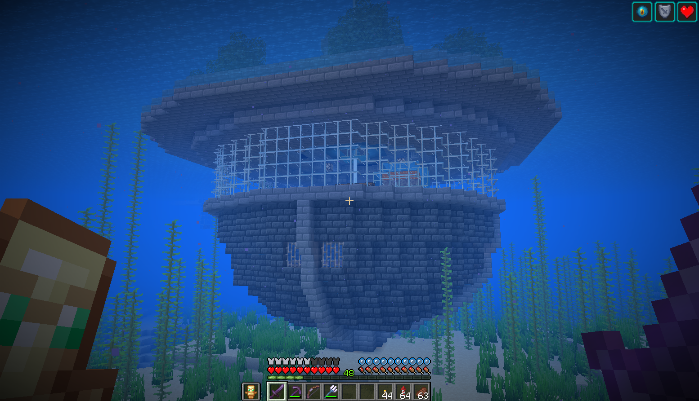

このゲームではその気になれば**ほぼ**全てのブロックやエンティティを自分の好きなように動かせるため、究極的にはどこに拠点を建てようと大きな問題は生じない。
しかし逆に言えば、プレイヤーが干渉出来ない部分 ── 初期スポーン地点やエンドポータルなど ── は、拠点の場所を決定する大きな要因になり得る。
故に、筆者はメイン拠点をエンド要塞の真上に建設した。
また、初期スポーン地点に最初の拠点を作っていたので、ネザーに線路を引いてトロッコで行き来出来るようにした。

このワールドではエンド要塞が深海バイオームに存在したため、設備の多くは海の中に建てている。ただし、コンジットを設置しているため溺れる心配はない。

#### 地上

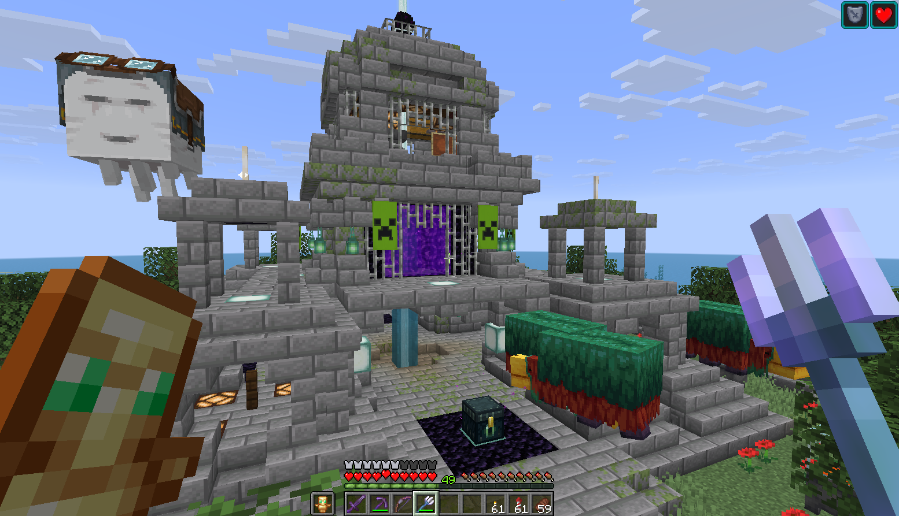

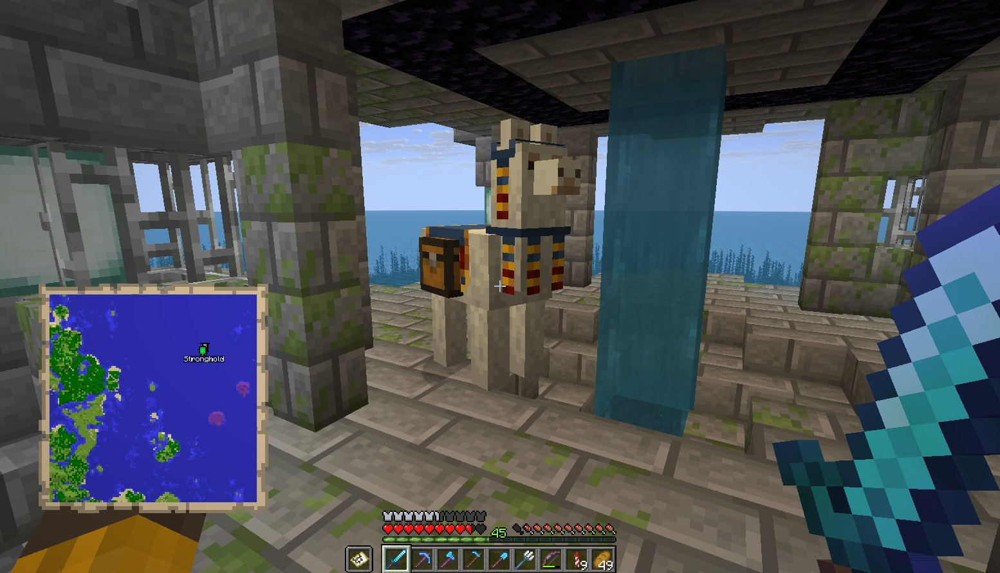

建物に関しては、エンド要塞に合わせて（苔むした）石レンガを中心に建てた。
また、建物だけだと殺風景なので土を敷き詰めて庭を作り、花を植えてある。
特に設計図があるわけではなく、建てては壊しを繰り返して拠点をつくっていった。

自分以外の居住者としてはハッピーガスト、スニッファー、アイアンゴーレム、そして行商人のラマなどがいる。
時々ネザーポータルからゾンビピグリンがやってくるが、すぐアイアンゴーレムに倒されてしまう。

#### 地下1階：装置置き場

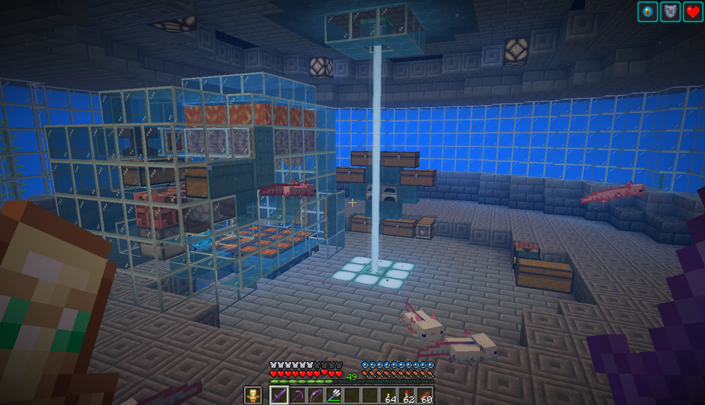

一面ガラス張りの地下1階には、いくつかの装置が置いてある。
今のところ、自動かまど、アレイ式経験値装置や溶岩無限回収機を設置している。
スペースを持て余している感が否めないので、今後装置を増やす予定。

#### 地下2階：倉庫

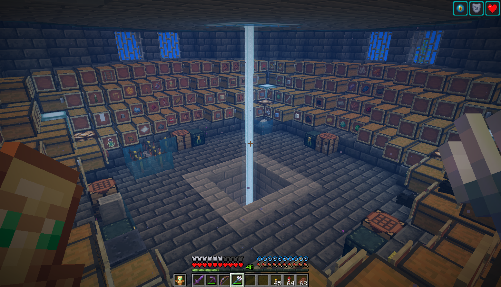

海中拠点のうち、下部の半球部分は倉庫となっている。水中であるため上下に移動することが出来、アイテムがとりやすい。
容量に関してもラージチェスト200個分は優に超えるので、シュルカーボックスと合わせれば当分倉庫がいっぱいになることはないだろう。

#### トラップ施設

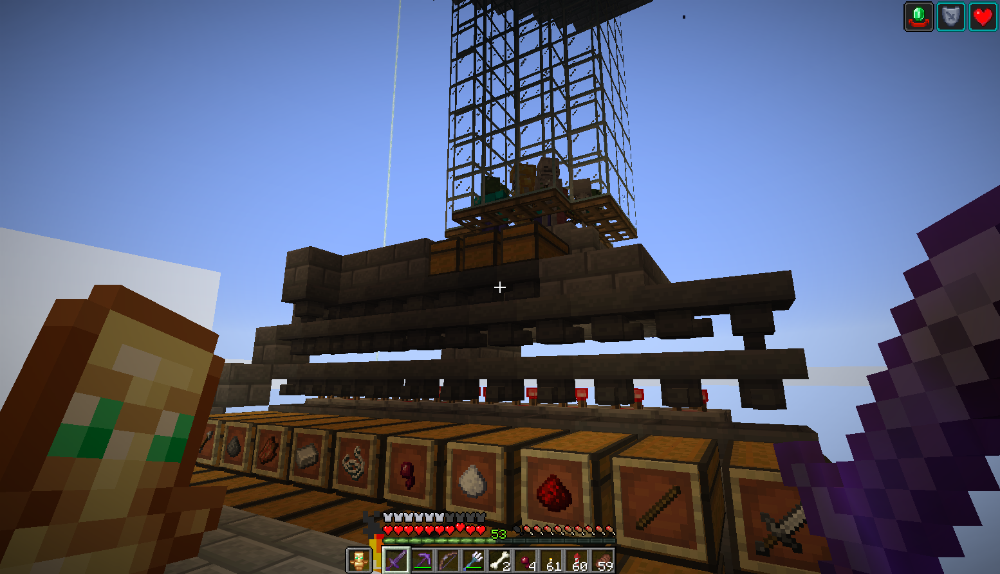

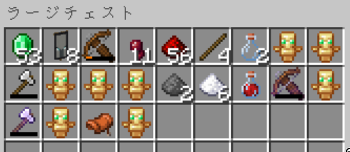

屋外に天空トラップタワーとレイドファームを用意している。
作る上で参考にした記事や動画は以下。

https://www.youtube.com/watch?v=BqbhQ6x8GKo

https://www.youtube.com/watch?v=0-wLpMFS5Aw

また、初期スポーン地点にはアイアンゴーレムトラップを作っている。
以下のサイトを参考にした。

https://kazihirablog.com/minecraft-irongolem-trap/

#### 交易所

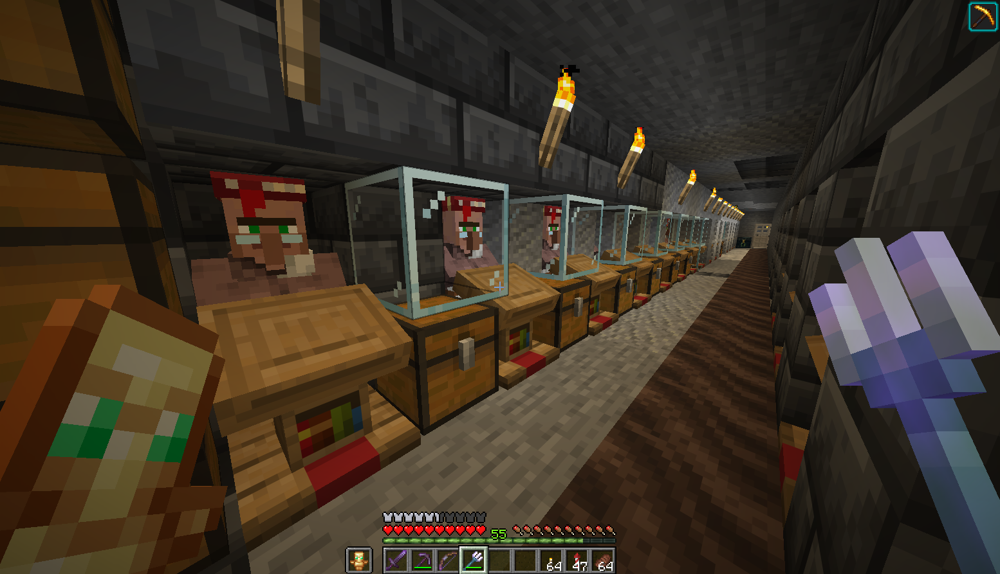

こちらはメイン拠点ではなく、初期スポーン地点の拠点に設置されている。
職業としては、ダイヤモンド装備を買える鍛冶屋とエンチャント本用の司書が中心である。
また、エメラルドはアイアンゴーレムトラップで得た鉄を鍛冶屋に売ったり、採掘で余った石を石工に売ったりして稼いでいる。

本当はメイン拠点の方に置きたいのだが、村人の輸送があまりに面倒なのでわざわざこちらで取引している。

#### 食料について

メイン拠点には畑が存在しないが、特に食料には困っていない。この拠点は`deep_lukewarm_ocean`バイオームに位置しており、近くにムーシュルームが無限湧きするキノコ島があるからだ。彼らを火属性の剣で乱獲すればいくらでもステーキ（と革）が手に入るため、農業や牧畜を行う必要はないというわけである。

### ⚔️装備・アイテム

#### ホットバー・インベントリ

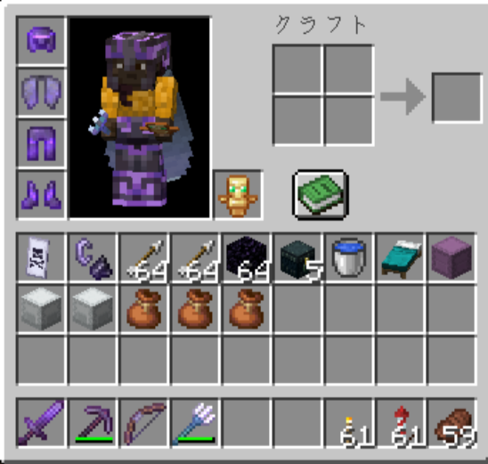

試行錯誤の結果、上記画像のような形に落ち着いた。恐らくよくある構成だが、拠点内や雨天時の移動用に激流トライデントを常備している点に個性が表れていると思う。
Geminiに評価してもらったところ「仮ブロックがない」「盾はいらない」と指摘されたため、盾のスペースを土あたりに変更しようと思う。

#### エンダーチェスト

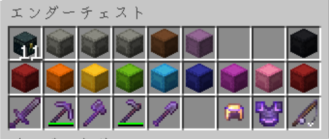

必要なものは大体入っている。
使う機会の多い装備は、取り出しやすいようにシュルカーボックスではなく下1列に直接収納している。

#### 各種コレクション

今のところ、レコードと鍛冶型は全て集めている。

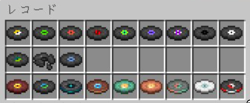

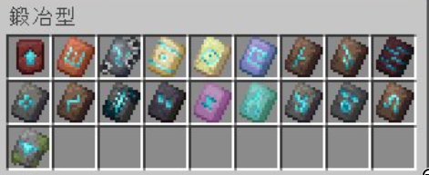

### 今後やりたいこと

まずはファーム、自動装置を拡充していきたい。
特にシュルカーボックスとシーランタンは無限化したいので、シュルカーとガーディアンのファームを作成することを最優先とする。

また、ネザー側の開拓も進めたい。ネザーを安全にすれば、ネザーでの移動および輸送を気軽に行えるようになるからだ。

進捗に関しては、いつか全て達成したいとは思うがすぐにやる気はない。
「モンスター狩りの達人[^monster]」と「冒険の時間[^adventure]」を達成しているので、ひとまず満足してしまった部分がある。

[^monster]: （ウォーデンを除く）全ての敵対Mobを討伐すると得られる進捗。

[^adventure]: 全てのバイオームに行くと得られる進捗。

## おわりに

Minecraftに一度ハマると数百時間は余裕で遊べてしまうため、特に睡眠時間を削ってしまわないよう注意する必要がある（n敗）。
